# 链表

|                    |        |                                                              |
| ------------------ | ------ | ------------------------------------------------------------ |
| 链表逆序           | easy   | https://leetcode.cn/problems/reverse-linked-list/description/ |
| 链表逆序2          | medium | https://leetcode.cn/problems/reverse-linked-list-ii/description/ |
| 链表求交点         | easy   | https://leetcode.cn/problems/intersection-of-two-linked-lists/description/ |
| 链表求环           | medium | https://leetcode.cn/problems/linked-list-cycle-ii/description/ |
| 链表划分           | medium | https://leetcode.cn/problems/partition-list/description/     |
| 复杂链表的深度拷贝 | hard   | https://leetcode.cn/problems/copy-list-with-random-pointer/description/ |
| 2个排序链表归并    | easy   | https://leetcode.cn/problems/merge-two-sorted-lists/description |
| K个排序链表归并    | hard   | https://leetcode.cn/problems/merge-k-sorted-lists/description/ |

# 链表基础

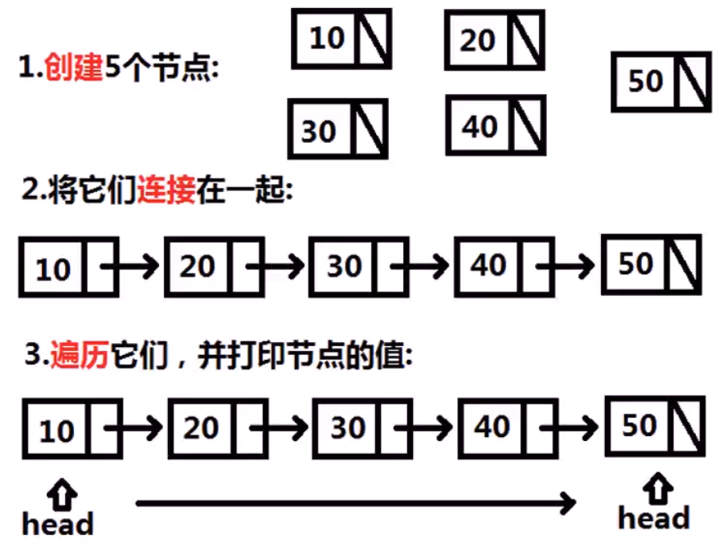

```c++
#include <stdio.h>
struct ListNode{
    int val;//存储元素的数据域
    ListNode *next;//存储下一个结点地址的指针域
};
```


```c++
int main(){
    ListNode a;
    ListNode b;
    ListNode c;
    ListNode d;
    ListNode e;
    a.val = 10;
    b.val = 20;
    c.val = 30;
    d.val = 40;
    e.val = 50;
    a.next = &b;
    b.next = &c;
    c.next = &d;
    d.next = &e;
    e.next = NULL;
    ListNode *head = &a;
    while(head){
        printf("%d\n", head->val);
    	head = head->next;
    }
    return 0;
}
```

# 链表逆序

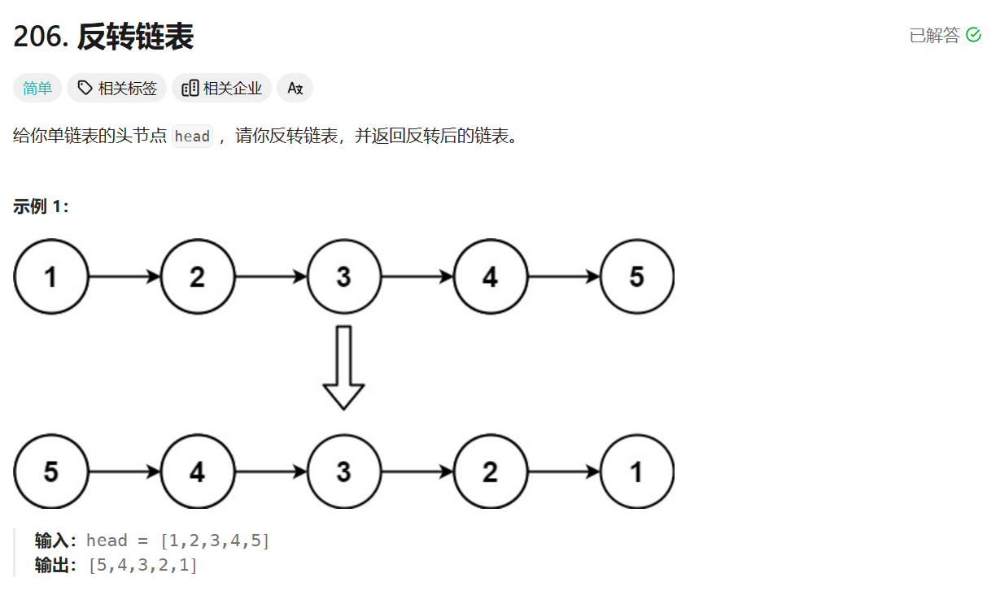

```c++
/**
 * Definition for singly-linked list.
 * struct ListNode {
 *     int val;
 *     ListNode *next;
 *     ListNode() : val(0), next(nullptr) {}
 *     ListNode(int x) : val(x), next(nullptr) {}
 *     ListNode(int x, ListNode *next) : val(x), next(next) {}
 * };
 */
class Solution {
public:
    ListNode* reverseList(ListNode* head) {
        ListNode* new_head = NULL;//指向新链表头结点的指针
        while(head){
            ListNode* next = head->next;
            head->next = new_head;
            new_head = head;
            head=next;//遍历链表
        }
        return new_head;//返回新链表头结点
    }
};
```

# 链表逆序2

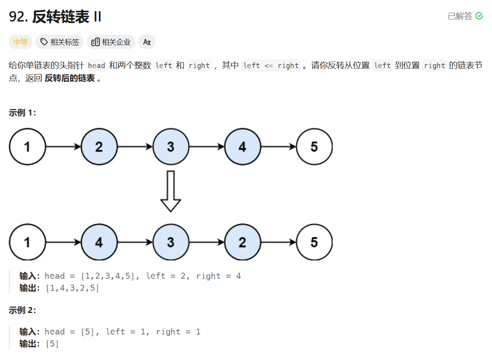

```c++
/**
 * Definition for singly-linked list.
 * struct ListNode {
 *     int val;
 *     ListNode *next;
 *     ListNode() : val(0), next(nullptr) {}
 *     ListNode(int x) : val(x), next(nullptr) {}
 *     ListNode(int x, ListNode *next) : val(x), next(next) {}
 * };
 */
class Solution {
public:
    ListNode* reverseBetween(ListNode* head, int left, int right) {
        int change_len=n-m+1;//计算需要逆置的结点个数
        ListNode *pre_head=NULL;//初始化开始逆置的结点的前驱
        ListNode *result=head;//最终转换后的链表头结点，非特殊情况即为head
        while(head&&--m){//将head向前移动m-1个位置
            pre_head = head;//记录head的前驱
            head=head->next;
        }
        ListNode *modify_list_tail=head;//将modify_list_tail指向当前的head,即逆置后的链表尾
        ListNode *new_head=NULL;
        while(head&&change_len){//逆置change_len个结点
            ListNode *next = head->next;
            head->next = new_head;
            new_head = head;
            head = next;
            change_len--;//每完成一个结点逆置，change_len--;
        }
        modify_list_tail->next=head;//连接逆置后的链表尾与逆置段的后一个结点
        if(pre_head){//如果pre_head不空，说明不是从第一个结点开始逆置的m>1
            result->next = new_head;//将逆置链表开始的结点前驱与逆置后的头结点连接
        }
        else{
            result = new_head;//如果pre_head为空,说明m==1从第一个结点开始逆置结果即为逆置后的头结点
        }
        return result;
    }
};
```

# 链表求交点

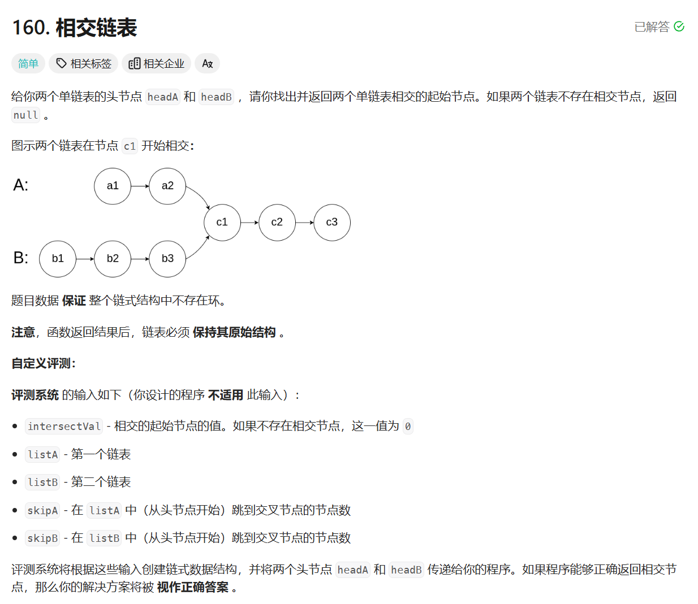

## 方法1（set的使用）

```c++
#include <stdio.h>
#include <set>//STL set的使用
//O(nlogn)或O(n)的方法判断两数组是否有相同元素
int main(){
    std::set<int> test_set;//STL set
    const int A_LEN=7;
    const int B_LEN=8;//测试数组A与B的长度
    int a[A_LEN]={5,1,4,8,10,1,3};
    int b[B_LEN]={2,7,6,3,1,6,0,1};
    for(int i=0;i<A_LEN;i++){
        test_set.insert(a[i]);//将数组a的元素插入set
    }
    for(int i=0;i<B_LEN;i++){
        if(test_set.find(b[i])!=test_set.end()){
            printf("b[%d]=%d in array A.\n",i,b[i]);
        }
    }
    return 0;
}
```

```c++
/**
 * Definition for singly-linked list.
 * struct ListNode {
 *     int val;
 *     ListNode *next;
 *     ListNode(int x) : val(x), next(NULL) {}
 * };
 */
class Solution {
public:
    ListNode *getIntersectionNode(ListNode *headA, ListNode *headB) {
        std::set<ListNode*>node_set;//设置查找集合node_set
        while(headA){
            node_set.insert(headA);//将链表A中的结点插入node_set
            headA=headA->next;//遍历链表A
        }
        while(headB){
            if(node_set.find(headB)!=node_set.end()){
                return headB;//当在headB中找到第一个出现在node_set中的结点时
            }
            headB=headB->next;//遍历链表B
        }
        return NULL;
    }
};
```

## 方法2（空间复杂度O(1)）

```c++
/**
 * Definition for singly-linked list.
 * struct ListNode {
 *     int val;
 *     ListNode *next;
 *     ListNode(int x) : val(x), next(NULL) {}
 * };
 */
class Solution {
private:
    int get_list_length(ListNode *head){
        int len=0;
        while(head){//遍历链表，计算链表长度
            len++;
            head=head->next;
        }
        return len;
    }
    ListNode* forward_long_list(int long_len,int short_len, ListNode* head){
        int delta=long_len-short_len;
        while(head&&delta){//将指针向前移动至多出结点个数后面的位置
            head=head->next;
            delta--;
        }
        return head;
    }
public:
    ListNode *getIntersectionNode(ListNode *headA, ListNode *headB) {
        int list_A_len=get_list_length(headA);
        int list_B_len=get_list_length(headB);//求A,B两个链表长度
        if(list_A_len>list_B_len){//如果链表A长，移动headA到对应位置
            headA=forward_long_list(list_A_len, list_B_len, headA);
        }
        else{//如果链表B长，移动headB到对应位置
            headB=forward_long_list(list_B_len, list_A_len, headB);
        }
        while(headA&&headB){
            if(headA==headB){
                return headA;
            }
            headA=headA->next;
            headB=headB->next;
        }
        return NULL;
    }
};
```

# 链表求环

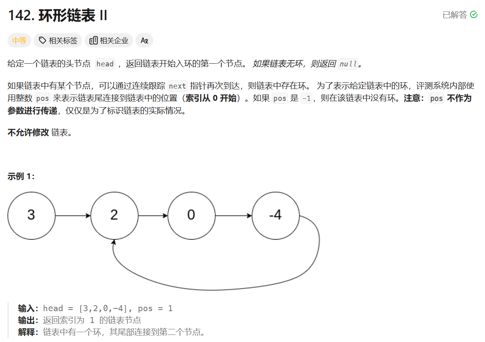

## 方法1（set的使用）

```c++
/**
 * Definition for singly-linked list.
 * struct ListNode {
 *     int val;
 *     ListNode *next;
 *     ListNode(int x) : val(x), next(NULL) {}
 * };
 */
class Solution {
public:
    ListNode *detectCycle(ListNode *head) {
        std::set<ListNode *>node_set;//设置node_set
        while(head){//遍历链表
            if(node_set.find(head)!=node_set.end()){
                return head;//返回环的第一个结点
            }
            node_set.insert(head);
            head=head->next;
        }
        return NULL;      
    }
};
```

## 方法2（快慢指针）

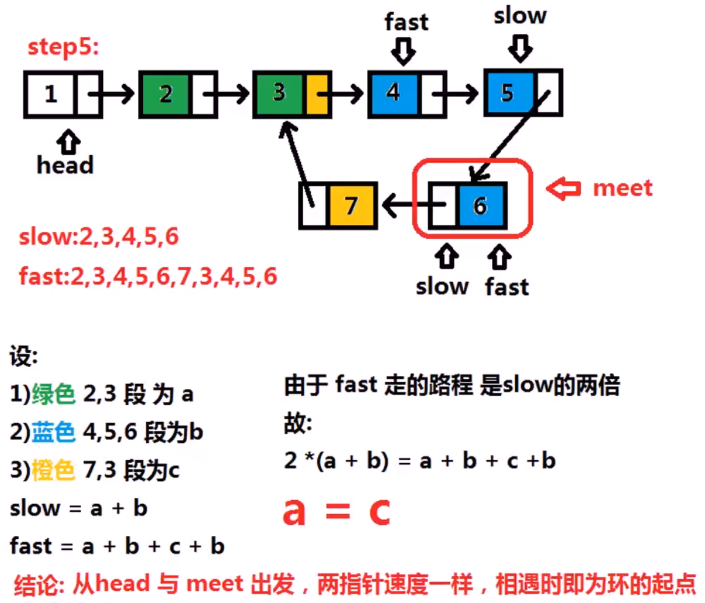

```c++
/**
 * Definition for singly-linked list.
 * struct ListNode {
 *     int val;
 *     ListNode *next;
 *     ListNode(int x) : val(x), next(NULL) {}
 * };
 */
class Solution {
public:
    ListNode *detectCycle(ListNode *head) {
        ListNode *fast = head;//快慢指针
        ListNode *slow = head;
        ListNode *meet = NULL;//相遇的结点
        while(fast){
            slow=slow->next;
            fast=fast->next;//slow与fast先各走一步
            if(!fast){
                return NULL;
            }
            fast=fast->next;
            if(fast==slow){
                meet=fast;
                break;
            }
        }
        if(meet==NULL){
            return NULL;
        }
        while(head&&meet){
            if(head==meet){
                return head;
            }
            head=head->next;//head与meet每次走1步
            meet=meet->next;
        }
        return NULL;
    }
};
```

# 链表划分

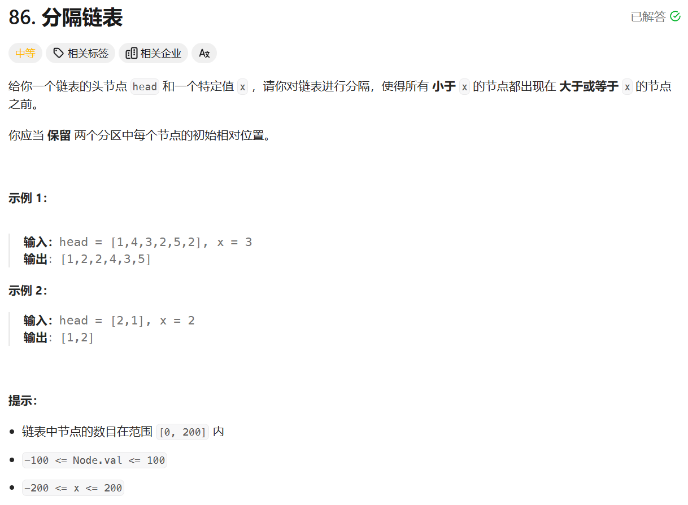

```c++
/**
 * Definition for singly-linked list.
 * struct ListNode {
 *     int val;
 *     ListNode *next;
 *     ListNode() : val(0), next(nullptr) {}
 *     ListNode(int x) : val(x), next(nullptr) {}
 *     ListNode(int x, ListNode *next) : val(x), next(next) {}
 * };
 */
class Solution {
public:
    ListNode* partition(ListNode* head, int x) {
        ListNode less_head(0);//设置两个临时的头结点
        ListNode more_head(0);
        ListNode *less_ptr=&less_head;//对应指针指向这两个头结点
        ListNode *more_ptr=&more_head;
        while(head){//如果结点值小于x，则将该结点插入less_ptr后
            if(head->val<x){
                less_ptr->next=head;//链接完成后，less_ptr向后移动，指向head
                less_ptr=head;
            }
            else{//否则将结点插入more_ptr后
                more_ptr->next=head;
                more_ptr=head;
            }
            head=head->next;//遍历链表
        }
        less_ptr->next = more_head.next;//将less链表尾，与more链表头相连
        more_ptr->next=NULL;//将more_ptr即链表尾结点next置空
        return less_head.next;
    }
};//less_head的next结点即为新链表头结点，返回
```

# 复杂链表的深度拷贝

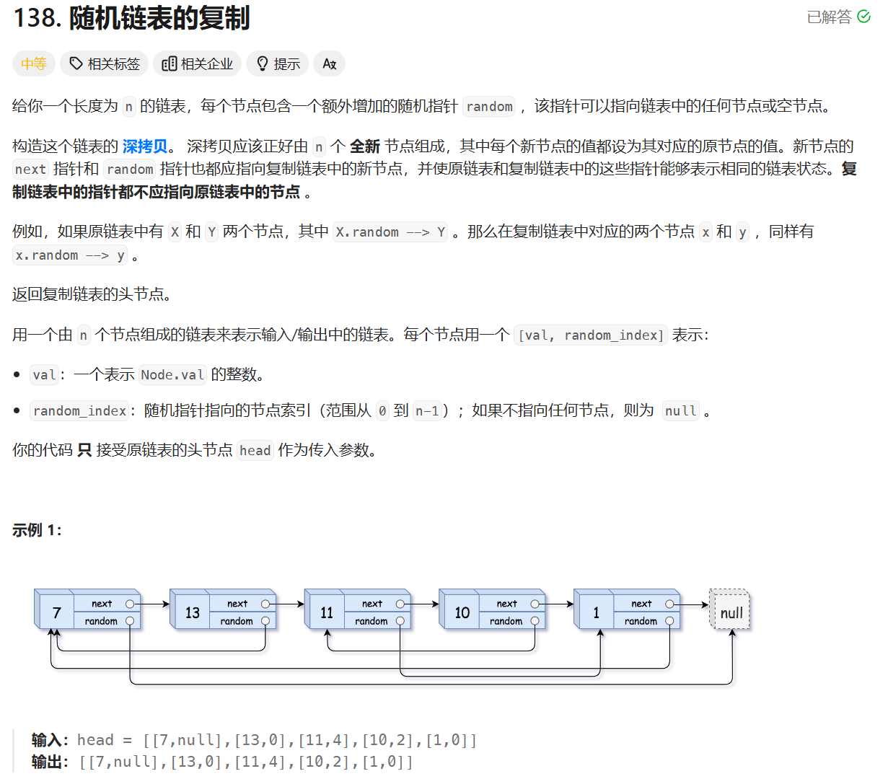

## STL MAP的使用

```c++
#include<stdio.h>
#include<map>//STL map头文件
struct RandomListNode{
    int label;
    RandomListNode *next, *random;
    RandomListNode(int x):label(x),next(NULL),random(NULL){}
};
```

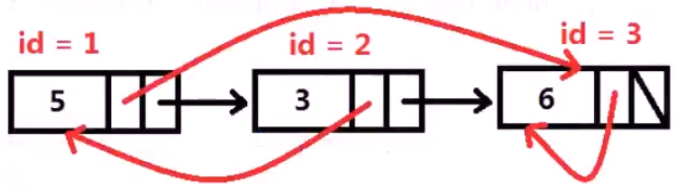

```c++
int main(){
    std::map<RandomListNode *,int>node_map;
    RandomListNode a(5);
    RandomListNode b(3);
    RandomListNode c(6);
    a.next=&b;
    b.next=&c;
    a.random=&c;
    b.random=&a;
    c.random=&c;
    node_map[&a]=1;
    node_map[&b]=2;
    node_map[&c]=3;
    printf("a.random id = %d\n",node_map[a.random]);
    printf("b.random id = %d\n",node_map[b.random]);
    printf("c.random id = %d\n",node_map[c.random]);
    return 0;
}
```

```c++
/*
// Definition for a Node.
class Node {
public:
    int val;//带有随机指针的链表结点
    Node* next;
    Node* random;
    
    Node(int _val) {
        val = _val;
        next = NULL;
        random = NULL;
    }
};
*/

class Solution {
public:
    Node* copyRandomList(Node* head) {
        std::map<Node *, int>node_map;//地址到结点位置的map
        std::vector<Node *>node_vec;//使用vector根据存储结点访问地址
        Node *ptr = head;
        int i=0;
        while(ptr){//将新链表结点push入node_vec，生成了新链表结点位置到地址的map
            node_vec.push_back(new Node(ptr->val));
            node_map[ptr]=i;//记录原始链表地址至结点位置的node_map
            ptr=ptr->next;//遍历原始列表
            i++;//i记录结点位置
        }
        node_vec.push_back(0);
        ptr=head;
        i=0;//再次遍历原始列表，连接新链表的next指针、random指针
        while(ptr){
            node_vec[i]->next= node_vec[i+1];//连接新链表next指针
            if(ptr->random){//当random指针不空时
                int id=node_map[ptr->random];//根据node_map确认
                node_vec[i]->random=node_vec[id];//原链表random指针指向的位置即id
            }
            ptr=ptr->next;
            i++;
        }
        return node_vec[0];
    }//返回是深度拷贝后的链表
    //深度拷贝：构造生成一个完全新的链表，即使将原链表毁坏，新链表可独立使用
};
```

# 2个排序链表归并

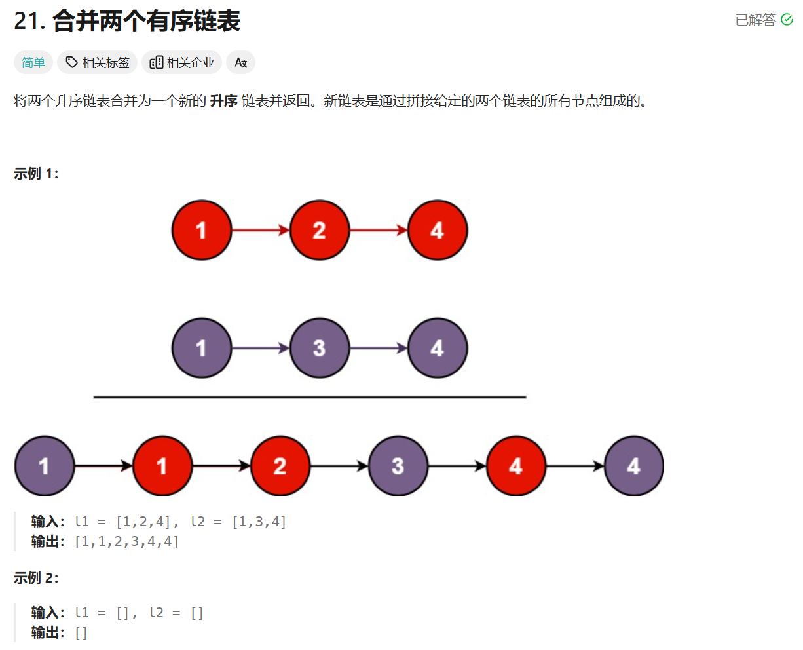

```c++
/**
 * Definition for singly-linked list.
 * struct ListNode {
 *     int val;
 *     ListNode *next;
 *     ListNode() : val(0), next(nullptr) {}
 *     ListNode(int x) : val(x), next(nullptr) {}
 *     ListNode(int x, ListNode *next) : val(x), next(next) {}
 * };
 */
class Solution {
public:
    ListNode* mergeTwoLists(ListNode* list1, ListNode* list2) {
        ListNode* l1=list1;
        ListNode* l2=list2;
        ListNode temp_head(0);//设置临时头结点temp_head
        ListNode *pre = &temp_head;//使用pre指针指向temp_head
        while(l1&&l2){//l1与l2同时不空时，对它们进行比较
            if(l1->val<l2->val){//如果l1对应的结点小于l2对应的结点
                pre->next=l1;
                l1=l1->next;
            }
            else{
                pre->next=l2;
                l2=l2->next;
            }//将pre与较小的结点进行连接
            pre=pre->next;//pre指向新连接的结点
        }
        if(l1){//如果l1有剩余
            pre->next=l1;//将l1接到pre后
        }
        if(l2){//如果l2有剩余
            pre->next=l2;//将l2接到pre后
        }
        return temp_head.next;
    }
};
```

# K个排序链表归并

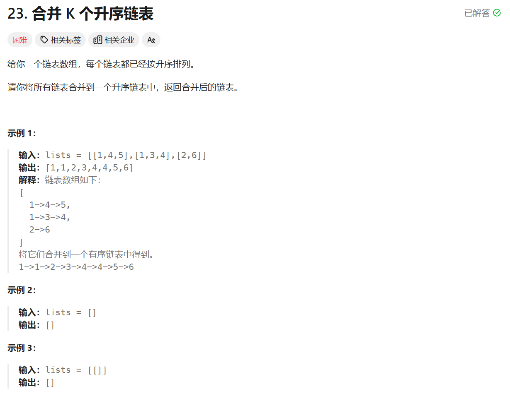

## 方法1 暴力合并

## 方法2 排序后相连

```c++
#include<vector>
#include<algorithm>//STL排序算法std::sort
bool cmp(const ListNode* a, const ListNode* b){
    return a->val<b->val;
}//比较函数，对结点进行从小到大的排序
int main(){
    ListNode a(3);
    ListNode b(2);
    ListNode c(5);
    ListNode d(0);
    std::vector<ListNode *>node_vec;
    node_vec.push_back(&a);
    node_vec.push_back(&b);
    node_vec.push_back(&c);
    node_vec.push_back(&d);
    std::sort(node_vec.begin(),node_vec.end(),cmp);
    for(int i=0;i<node_vec.size();i++){
        printf("%d\n",node_vec[i]->val);
    }
    return 0;
}
```

```c++
/**
 * Definition for singly-linked list.
 * struct ListNode {
 *     int val;
 *     ListNode *next;
 *     ListNode() : val(0), next(nullptr) {}
 *     ListNode(int x) : val(x), next(nullptr) {}
 *     ListNode(int x, ListNode *next) : val(x), next(next) {}
 * };
 */
class Solution {
private:
    
public:
    static bool cmp(const ListNode* a, const ListNode* b){
        return a->val<b->val;
    }
    ListNode* mergeKLists(vector<ListNode*>& lists) {
        std::vector<ListNode*>node_vec;
        for(int i=0;i<lists.size();i++){
            ListNode* head=lists[i];//遍历k个链表,将结点全部添加至node_vec
            while(head){
                node_vec.push_back(head);
                head=head->next;
            }
        }
        if(node_vec.size()==0){
            return NULL;
        }
        std::sort(node_vec.begin(),node_vec.end(),cmp);//根据结点数值进行排序
        for(int i=1;i<node_vec.size();i++){//连接新的链表
            node_vec[i-1]->next=node_vec[i];
        }
        node_vec[node_vec.size()-1]->next=NULL;
        return node_vec[0];
    }
};
```

## 方法3 分治后相连

```c++
/**
 * Definition for singly-linked list.
 * struct ListNode {
 *     int val;
 *     ListNode *next;
 *     ListNode() : val(0), next(nullptr) {}
 *     ListNode(int x) : val(x), next(nullptr) {}
 *     ListNode(int x, ListNode *next) : val(x), next(next) {}
 * };
 */
class Solution {
public:
    static bool cmp(ListNode* a, ListNode* b){
        return a->val<b->val;
    }
    ListNode* mergeTwoLists(ListNode* l1,ListNode* l2){
        std::vector<ListNode*> node_vec;
        while(l1){
            node_vec.push_back(l1);
            l1=l1->next;
        }
        while(l2){
            node_vec.push_back(l2);
            l2=l2->next;
        }
        if(node_vec.size()==0){
            return NULL;
        }
        std::sort(node_vec.begin(),node_vec.end(),cmp);
        for(int i=1;i<node_vec.size();i++){
            node_vec[i-1]->next=node_vec[i];
        }
        node_vec[node_vec.size()-1]->next=NULL;
        return node_vec[0];
    }
    ListNode* mergeKLists(vector<ListNode*>& lists) {
        if(lists.size()==0){//如果lists为空，返回NULL
            return NULL;
        }
        if(lists.size()==1){
            return lists[0];
        }
        if(lists.size()==2){//如果只有两个list，调用两个list merge函数
            return mergeTwoLists(lists[0],lists[1]);
        }
        int mid = lists.size()/2;
        std::vector<ListNode*>sub1_lists;
        std::vector<ListNode*>sub2_lists;//拆分lists为两个子lists
        for(int i=0;i<mid;i++){
            sub1_lists.push_back(lists[i]);
        }
        for(int i=mid;i<lists.size();i++){
            sub2_lists.push_back(lists[i]);
        }
        ListNode *l1=mergeKLists(sub1_lists);
        ListNode *l2=mergeKLists(sub2_lists);
        return mergeTwoLists(l1,l2);//分治处理
    }
};
```

