# 栈、队列、堆

|                            |        |                                                              |
| -------------------------- | ------ | ------------------------------------------------------------ |
| 使用队列实现栈（栈、队列） | easy   | https://leetcode.cn/problems/implement-stack-using-queues/description/ |
| 使用栈实现队列（栈、队列） | easy   | https://leetcode.cn/problems/implement-queue-using-stacks/description/ |
| 包含min函数的栈（栈）      | easy   | https://leetcode.cn/problems/min-stack/description/          |
| 合法的出栈序列（栈、队列） | medium | [http://poj.org/problem?id=1363](http://poj.org/problem?id=1363) |
| 简单的计算器（栈）         | hard   | https://leetcode.cn/problems/basic-calculator/description/   |
| 数组中第K大的数（堆）      | easy   | https://leetcode.cn/problems/kth-largest-element-in-an-array/description/ |
| 寻找中位数（堆）           | hard   | https://leetcode.cn/problems/find-median-from-data-stream/description |

# 栈与队列

## STL stack（栈）

栈，先进后出的线性表

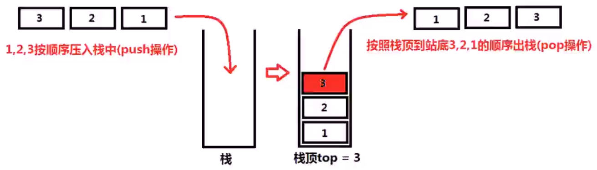

---

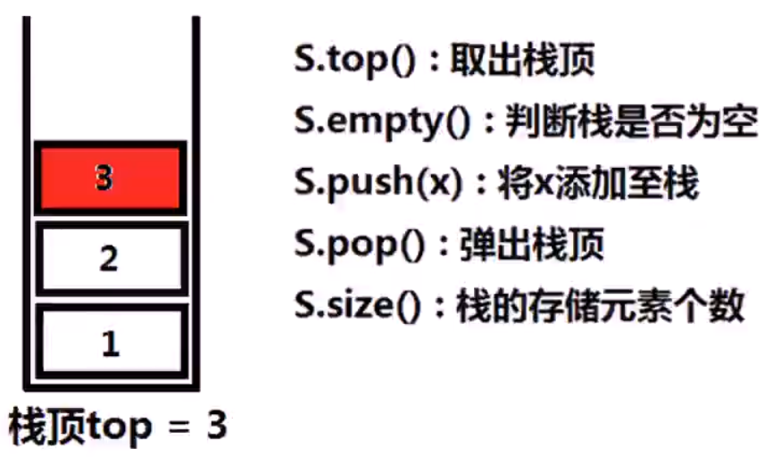

```c++
#include<stdio.h>
#include<stack>
int main(){
    std::stack<int>S;
    if(S.empty()){
        printf("S is empty!");
    }
    S.push(5);
    S.push(6);
    S.push(10);
    printf("S.top=%d\n",S.top());
    S.pop();
    S.pop();
    printf("S.top=%d\n",S.top());
    printf("S.size=%d\n",S.size());
    return 0;
}
```

## STL queue（队列）

队列，先进先出的线性表

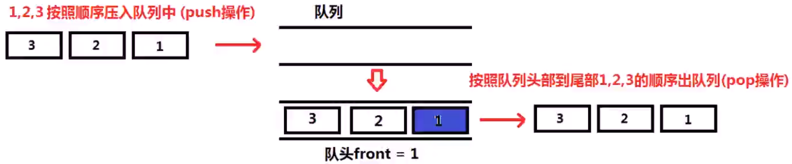

---

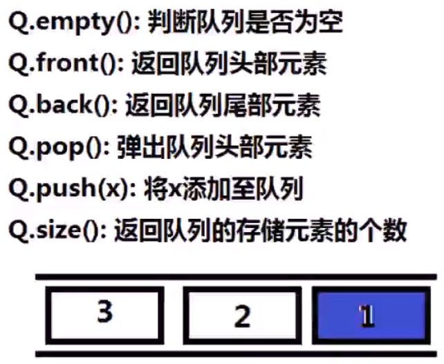

```c++
#include <stdio.h>
#include <queue>
int main(){
    std::queue<int>Q;
    if(Q.empty()){
        printf("Q is empty!\n");
    }
    Q.push(5);
    Q.push(6);
    Q.push(10);
    printf("Q.front=%d\n",Q.front());
    Q.pop();
    Q.pop();
    printf("Q.front=%d\n",Q.front());
    Q.push(1);
    printf("Q.back=%d\n",Q.back());
    printf("Q.size=%d\n",Q.size());
    return 0;
}
```

# 使用队列实现栈（栈、队列）

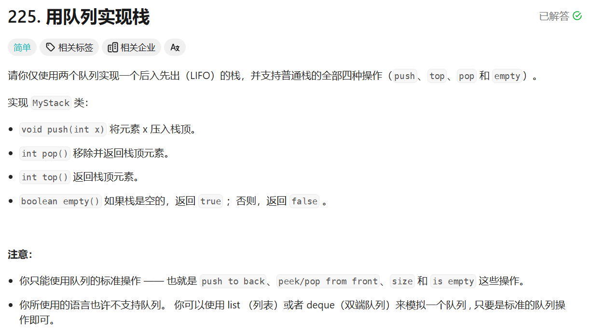

```c++
class MyStack {
public:
    MyStack() {//临时队列，利用该队列进行原始data_queue元素
        //与新元素的次序调换
    }
    
    void push(int x) {
        std::queue<int> temp_queue;
        temp_queue.push(x);
        while(!_data.empty()){
            temp_queue.push(_data.front());
            _data.pop();
        }
        while(!temp_queue.empty()){
            _data.push(temp_queue.front());
            temp_queue.pop();
        }
    }//pop弹出栈顶并返回栈顶元素
    
    int pop() {
        int x=_data.front();//取栈顶元素，即为队列头部元素
        _data.pop();//弹出队列头部元素
        return x;//返回取出的队列头部元素x，即为栈顶元素
    }
    
    int top() {
        return _data.front();//返回栈顶即直接返回队列头部元素
    }
    
    bool empty() {
        return _data.empty();
    }
private:
    std::queue<int>_data;//_data数据队列存储元素的顺序就是栈存储元素的顺序
};

/**
 * Your MyStack object will be instantiated and called as such:
 * MyStack* obj = new MyStack();
 * obj->push(x);
 * int param_2 = obj->pop();
 * int param_3 = obj->top();
 * bool param_4 = obj->empty();
 */
```

# 使用栈实现队列（栈、队列）

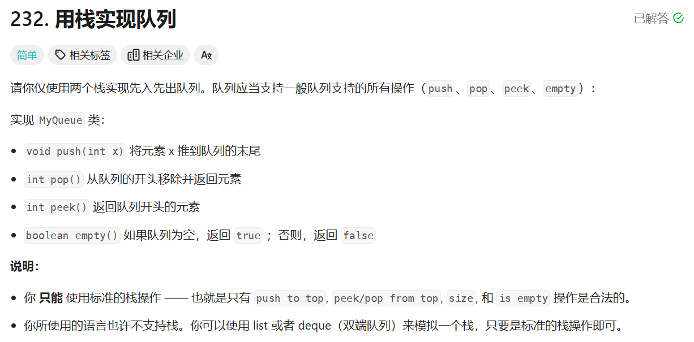

```c++
class MyQueue {
public:
    MyQueue() {//设置临时栈用来调换
        
    }
    
    void push(int x) {//数据栈data_stack中元素的次序
        std::stack<int>temp_stack;
        while(!_data.empty()){//只要_data数据不空
            temp_stack.push(_data.top());
            _data.pop();
        }
        temp_stack.push(x);
        while(!temp_stack.empty()){
            _data.push(temp_stack.top());//只要临时栈不为空
            temp_stack.pop();
        }
    }//弹出队列头部元素并返回
    
    int pop() {
        int x=_data.top();
        _data.pop();//将栈顶存储至x
        return x;
    }//弹出栈顶，返回x
    
    int peek() {
        return _data.top();
    }
    
    bool empty() {
        return _data.empty();
    }
private:
    std::stack<int> _data;
};

/**
 * Your MyQueue object will be instantiated and called as such:
 * MyQueue* obj = new MyQueue();
 * obj->push(x);
 * int param_2 = obj->pop();
 * int param_3 = obj->peek();
 * bool param_4 = obj->empty();
 */
```

# 包含min函数的栈（栈）

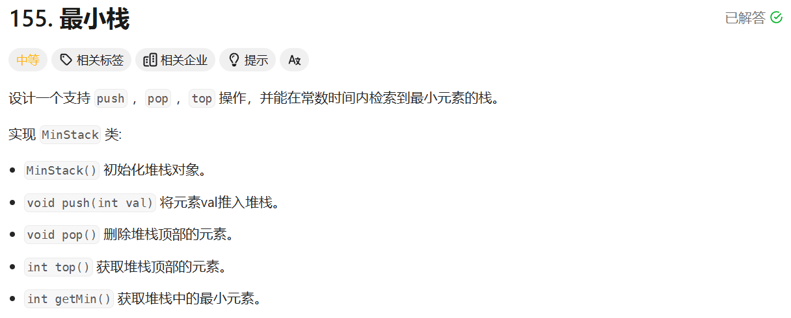

```c++
class MinStack {
public:
    MinStack() {
        
    }
    
    void push(int val) {//将数据压入数据栈
        _data.push(val);
        if(_min.empty()){//如果最小值栈为空，直接将x进入最小值栈
            _min.push(val);
        }
        else{//如果新数据大于最小值栈的栈顶，则将x赋值为最小值栈顶元素
            if(val>_min.top()){
                val=_min.top();
            }
            _min.push(val);//将x push进入最小值栈
        }
    }
    
    void pop() {
        _data.pop();//数据栈与最小值栈同时弹出
        _min.pop();
    }
    
    int top() {//top即返回数据栈栈顶
        return _data.top();
    }

    int getMin(){//top即返回数据栈栈顶
        return _min.top();
    }

private:
    std::stack<int> _data;//数据栈
    std::stack<int> _min;//最小值栈
};

/**
 * Your MinStack object will be instantiated and called as such:
 * MinStack* obj = new MinStack();
 * obj->push(val);
 * obj->pop();
 * int param_3 = obj->top();
 * int param_4 = obj->getMin();
 */
```

# 合法的出栈序列（栈、队列）

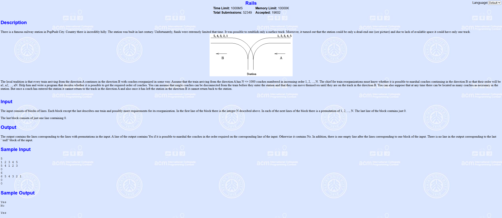

```c++
#include <stack>
#include <queue>//检查序列（存储在队列中）
bool check_is_valid_order(std::queue<int> &order){
    std::stack<int>S;//S为模拟栈
    int n=order.size();//n为序列长度，将1到n按顺序入栈
    for(int i=1;i<=n;i++){
        S.push(i);
        while(!S.empty()&&order.front()==S.top()){
            S.pop();
            order.pop();
        }
    }
    if(!S.empty()){//如果栈不空，就返回false即不是合法的序列
		return false;
    }
    return true;
}
```

# 简单的计算器（栈）

## 字符串转换数字

```cpp
#include<stdio.h>
#include<string>
int main(){//将字符串“12345”转换为整型12345
    int number=0;
    std::string s="12345";
    for(int i=0;i<s.length();i++){
        number=number*10+s[i]-'0';
    }
    printf("number=%d\n",number);
    return 0;
}
```

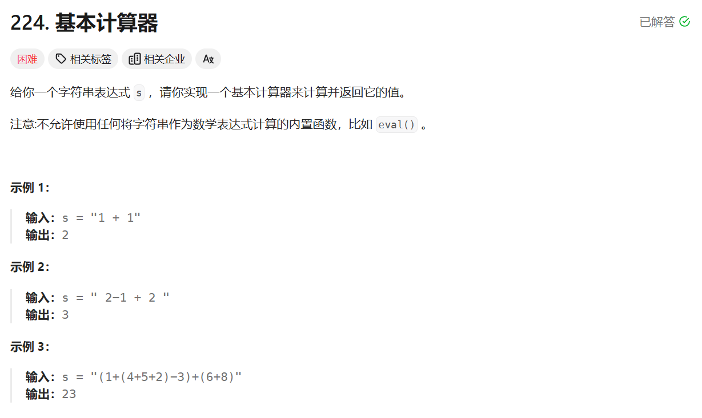

---

```c++
class Solution {
public:
    int calculate(string s) {
        stack<int> ops;
        ops.push(1);
        int sign = 1;

        int ret = 0;
        int n = s.length();
        int i = 0;
        while (i < n) {
            if (s[i] == ' ') {
                i++;
            } else if (s[i] == '+') {
                sign = ops.top();
                i++;
            } else if (s[i] == '-') {
                sign = -ops.top();
                i++;
            } else if (s[i] == '(') {
                ops.push(sign);
                i++;
            } else if (s[i] == ')') {
                ops.pop();
                i++;
            } else {
                long num = 0;
                while (i < n && s[i] >= '0' && s[i] <= '9') {
                    num = num * 10 + s[i] - '0';
                    i++;
                }
                ret += sign * num;
            }
        }
        return ret;
    }
};
```

# 数组中第K大的数（堆）

## STL优先级队列（二叉堆）

最（大）小二叉堆，最（大）小值先出的完全二叉树。

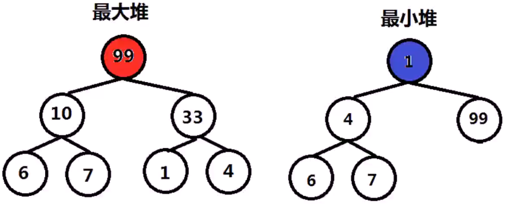

二叉堆，最小（大）值先出的完全二叉树。

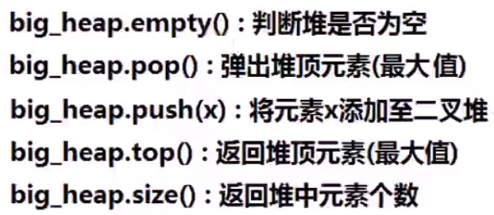

```c++
#include<stdio.h>
#include<queue>
int main(){
    std::priority_queue<int> big_heap;//默认构造是最大堆
    std::priority_queue<int, std::vector<int>,//最小堆构造方法
    				std::greater<int>>small_heap;
    std::priority_queue<int, std::vector<int>,//最大堆构造方法
    				std::less<int>>big_heap2;
    if(big_heap.empty()){
        printf("big_heap is empty!\n");
    }
    int test[]={6,10,1,7,99,4,33};
    for(int i=0;i<7;i++){
        big_heap.push(test[i]);
    }
    printf("big_heap.top=%d\n",big_heap.top());
    big_heap.push(1000);
    printf("big_heap.top=%d\n",big_heap.top());
    for(int i=0;i<3;i++){
        big_heap.pop();
    }
    printf("big_heap.top = %d\n", big_heap.top());
    printf("big_heap.size = %d\n", big_heap.size());
    return 0;
}
```

---

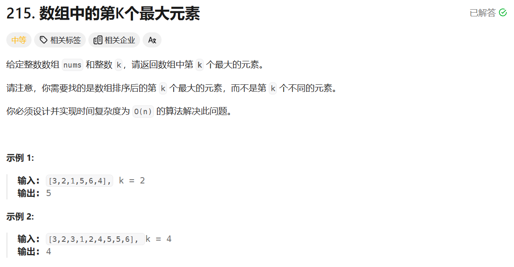

```c++
class Solution {
public:
    int findKthLargest(vector<int>& nums, int k) {
        std::priority_queue<int,std::vector<int>,std::greater<int>> Q;//最小堆
        for(int i=0;i<nums.size();i++){//遍历nums数组
            if(Q.size()<k){
                Q.push(nums[i]);
            }
            else if(nums[i]>Q.top()){
                Q.pop();
                Q.push(nums[i]);
            }
        }
        return Q.top();//返回堆顶
    }
};
```

# 寻找中位数（堆）

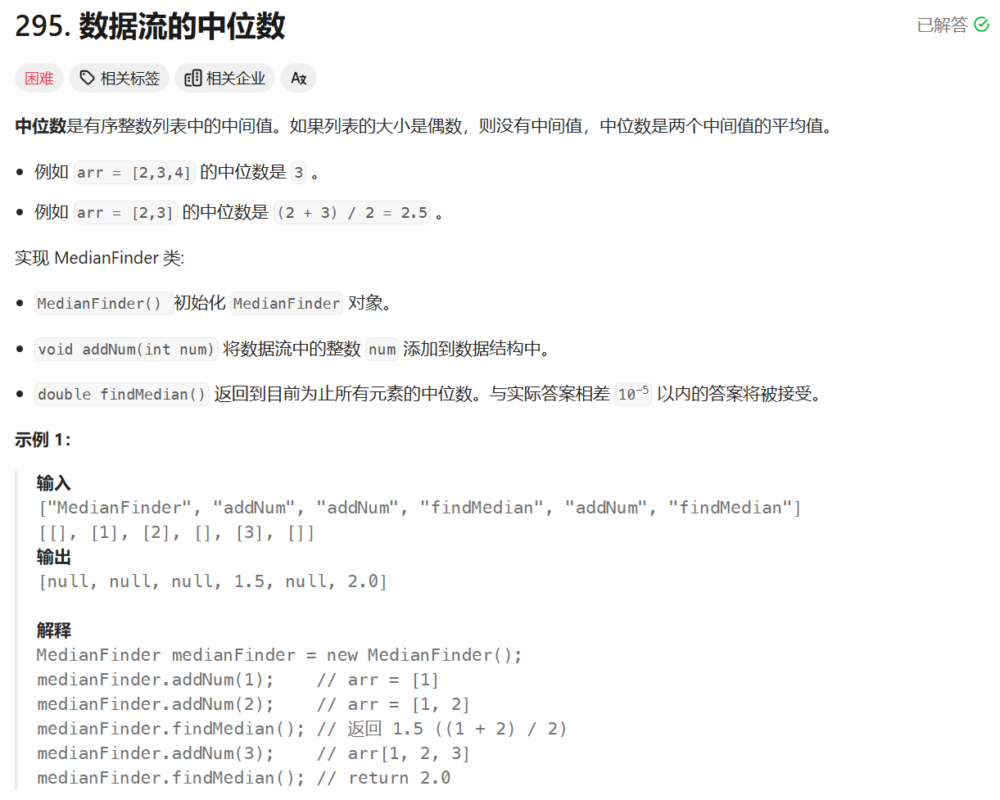

```c++
class MedianFinder {
public:
    MedianFinder() {
        
    }
    
    void addNum(int num) {
        if(big_queue.empty()){//big_queue最大堆
            big_queue.push(num);//small_queue最小堆
            return;
        }
        if(big_queue.size()==small_queue.size()){
            if(num<big_queue.top()){
                big_queue.push(num);
            }
            else{
                small_queue.push(num);
            }
        }
        else if(small_queue.size()<big_queue.size()){
            if(num>big_queue.top()){
                small_queue.push(num);
            }
            else{
                small_queue.push(big_queue.top());
                big_queue.pop();
                big_queue.push(num);
            }
        }
        else if(small_queue.size()>big_queue.size()){
            if(num<small_queue.top()){
                big_queue.push(num);
            }
            else{
                big_queue.push(small_queue.top());
                small_queue.pop();
                small_queue.push(num);
            }
        }
    }
    
    double findMedian() {
        if(small_queue.size()==big_queue.size()){
            return (big_queue.top()+small_queue.top())/2;
        }
        else if(big_queue.size()>small_queue.size()){
            return big_queue.top();
        }
        return small_queue.top();
    }
private:
    std::priority_queue<double,std::vector<double>,std::greater<double>> small_queue;
    std::priority_queue<double,std::vector<double>,std::less<double>> big_queue;
};

/**
 * Your MedianFinder object will be instantiated and called as such:
 * MedianFinder* obj = new MedianFinder();
 * obj->addNum(num);
 * double param_2 = obj->findMedian();
 */
```

