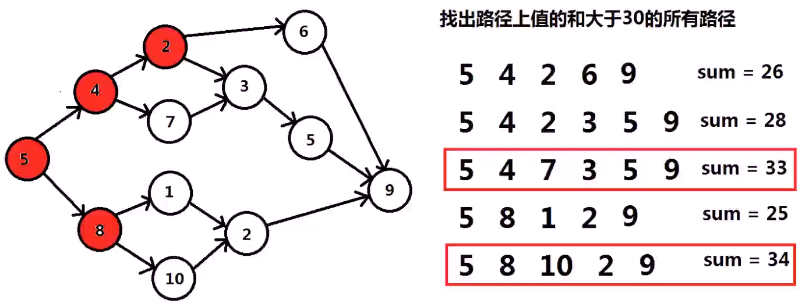

# 递归、回溯与分治

|                                |        |                                                              |
| ------------------------------ | ------ | ------------------------------------------------------------ |
| 求子集（回溯法、位运算法）     | medium | https://leetcode.cn/problems/subsets/description/            |
| 求子集2（回溯法）              | medium | https://leetcode.cn/problems/subsets-ii/description/         |
| 组合数之和2（回溯法、剪枝）    | medium | https://leetcode.cn/problems/combination-sum-ii/description/ |
| 生成括号（递归设计）           | medium | https://leetcode.cn/problems/generate-parentheses/description/ |
| N皇后（回溯法）                | hard   | https://leetcode.cn/problems/n-queens/description/           |
| 逆序数（分治法、归并排序应用） | hard   | https://leetcode.cn/problems/count-of-smaller-numbers-after-self/description/ |

# 递归函数基础

```c++
#include<stdio.h>
void compute_sum_3(int i, int &sum){//i=3,将sum加上3
    sum+=i;
}
void compute_sum_2(int i, int &sum){//i=2,将sum加上2,调用compute_sum_3(3,sum)
	sum+=i;
    compute_sum_3(i+1,sum);
}
void compute_sum_1(int i, int &sum){//i=1,将sum加上1,调用compute_sum_2(2,sum)
    sum+=i;
    compute_sum_2(i+1,sum);
}
int main(){
    int sum=0;//计算1+2+3
    compute_sum_1(1,sum);
    printf("sum=%d\n",sum);//将结果存储至sum,并打印sum
    return 0;
}
```

```c++
#include<stdio.h>
void compute_sum(int i, int &sum){
    if(i>3){//i>3时,结束递归调用
        return;
    }
    sum+=i;//将i累加至sum
    compute_sum(i+1,sum);//递归调用,下一次调用会累加i+1
}
int main(){
    int sum=0;
    compute_sum(1,sum);
    printf("sum=%d\n",sum);
    return 0;
}
```

```c++
#include<stdio.h>
#include<vector>
struct ListNode{//链表数据结构
    int val;
    ListNode* next;
    ListNode(int x):val(x),next(NULL){}
};
//递归将head指针指向的结点的数据域val,push到vec里
void add_to_vector(ListNode* head, std::vector<int> &vec){
    if(!head){
        return;
    }
    vec.push_back(head->val);
    add_to_vector(head->next,vec);
}
int main(){
    ListNode a(1);
	ListNode b(2);
	ListNode c(3);
	ListNode d(4);
    ListNode e(5);
    a.next=&b;
    b.next=&c;
    c.next=&d;
    d.next=&e;
    std::vector<int>vec;
    add_to_vector(&a,vec);
    for(int i=0;i<vec.size();i++){
        printf("[%d]",vec[i]);
    }
    printf("\n");
    return 0;
}
```

# 回溯法

回溯法又称为试探法，但当探索到某一步时，发现原先选择达不到目标，就退回一步重新选择，这种走不通就退回再走的技术为回溯法。


