# 二叉树与图

|                              |        |                                                              |
| ---------------------------- | ------ | ------------------------------------------------------------ |
| 路径之和2（二叉树深搜）      | medium | https://leetcode.cn/problems/path-sum-ii/description/        |
| 最近的公共祖先（二叉树性质） | medium | https://leetcode.cn/problems/lowest-common-ancestor-of-a-binary-tree/description/ |
| 二叉树转链表（二叉树与链表） | medium | https://leetcode.cn/problems/flatten-binary-tree-to-linked-list/description/ |
| 侧面观察二叉树（二叉树宽搜） | medium | https://leetcode.cn/problems/binary-tree-right-side-view/description/ |
| 课程安排（有向图判断环）     | medium | https://leetcode.cn/problems/course-schedule/description/    |

# 二叉树定义

$$
\begin{align}
&树是n(n\geq 0)个结点的有限集,且这些结点满足如下关系:\\
&(1)有且仅有一个结点没有父结点,该结点称为树的根\\
&(2)除根外,其余的每个结点都有且仅有一个父结点\\
&(3)树中的每一个结点都构成一个以它为根的树\\
&二叉树在满足树的条件时,满足如下条件:\\
&每个结点最多有两个孩子(子树),这两个子树有左右之分,次序不可颠倒.
\end{align}
$$

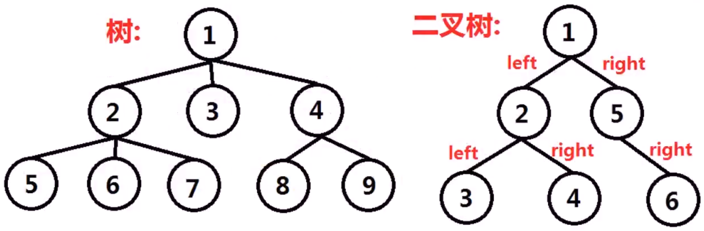

# 二叉树构造


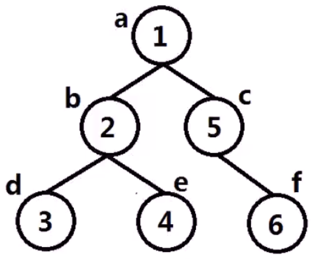

```c++
#include<stdio.h>
struct TreeNode{//二叉树数据结构
    int val;//数据域val
    TreeNode* left;//left,right左右子树指针
    TreeNode* right;
    TreeNode(int x):val(x),left(NULL),right(NULL){}
};
//正在遍历的结点,当前结点的层数
void preorder_print(TreeNode* node, int layer){
    if(!node){
        return;
    }
    for(int i=0;i<layer;i++){
        printf("-----");//根据层数,打印相应数量的'-'
    }
    printf("[%d]\n",node->val);
    preorder_print(node->left,layer+1);//遍历左子树,层数+1
    preorder_print(node->right,layer+1);//遍历右子树,层数+1
}
int main(){
    TreeNode a(1);
    TreeNode b(2);
    TreeNode c(5);
    TreeNode d(3);
    TreeNode e(4);
    TreeNode f(6);
    a.left=&b;
    a.right=&c;
    b.left=&d;
    b.right=&e;
    c.right=&f;
    preorder_print(&a,0);
    return 0;
}
```

# 二叉树的深度遍历

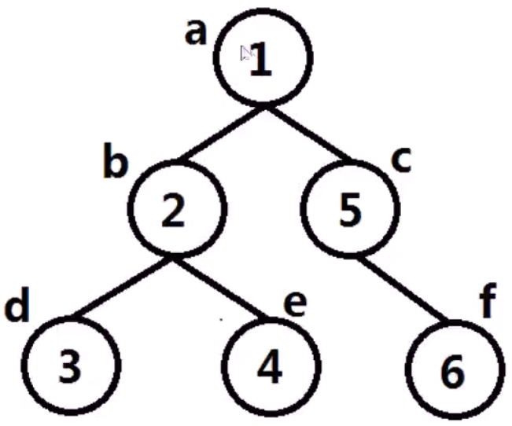

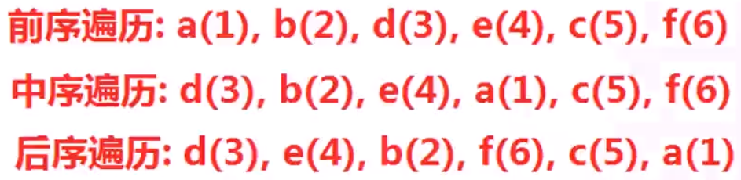

```c++
void traversal(TreeNode* node){
	if(!node){
        return;
    }
    //此时访问node称为前序遍历
    traversal(node->left);
    //此时访问node称为中序遍历
    traversal(node->right);
    //此时访问node称为后序遍历
}
```

---

```c++
void traversal_print1(TreeNode* node, int layer){
    if(!node){
        return;
    }
    traversal_print1(node->left,layer+1);
    for(int i=0;i<layer;i++){
        printf("-----");
    }
    printf("[%d]\n",node->val);
    traversal_print1(node->right,layer+1);
}
void traversal_print2(TreeNode* node, int layer){
    if(!node){
        return;
    }
    traversal_print2(node->left,layer+1);
    traversal_print2(node->right,layer+1);
    for(int i=0;i<layer;i++){
        printf("-----");
    }
    printf("[%d]\n",node->val);
}
void traversal_print3(TreeNode* node, int layer){
    if(!node){
        return;
    }
    for(int i=0;i<layer;i++){
        printf("-----");
    }
    printf("[%d]\n",node->val);
    traversal_print3(node->left,layer+1);
    traversal_print3(node->right,layer+1);
}
```

# 二叉树的层次遍历

二叉树层次遍历，又称为宽度优先搜索，桉树的层次依次访问树的结点。层次遍历使用队列对遍历结点进行存储，先进入队列的结点，优先遍历拓展其左孩子与右孩子。

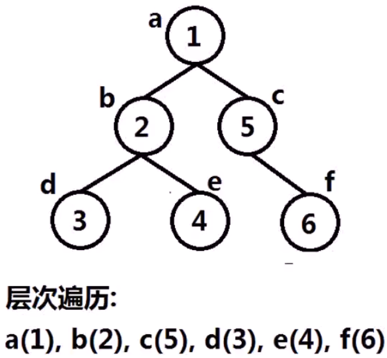

```
设置队列Q
将根结点push进Q
while(Q不空){
	取出队列头部结点node
	对node访问
	将node的左、右孩子push进队列
}
```

```c++
#include<stdio.h>
#include<vector>
#include<queue>
struct TreeNode{//二叉树数据结构
    int val;
    TreeNode* left;
    TreeNode* right;
    TreeNode(int x):val(x),left(NULL),right(NULL){}
};
void BFS_print(TreeNode* root){//宽度优先搜索二叉树
    std::queue<TreeNode*>Q;
    Q.push(root);
    while(!Q.empty()){
        TreeNode* node=Q.front();
        Q.pop();
        printf("[%d]\n",node->val);
        if(node->left){
            Q.push(node->left);
        }
        if(node->right){
            Q.push(node->right);
        }
    }
}
int main(){
    TreeNode a(1);
    TreeNode b(2);
    TreeNode c(5);
    TreeNode d(3);
    TreeNode e(4);
    TreeNode f(6);
    a.left=&b;
    a.right=&c;
    b.left=&d;
    b.right=&e;
    c.right=&f;
    BFS_print(&a);
    return 0;
}
```

# 图的定义

图（Graph）是由顶点的有穷非空集合和顶点之间边的集合组成，通常表示为：G(V,E)，其中，G表示一个图，V是图G中顶点的集合，E是图G中边的集合。图分无向图与有向图，根据图的边长，又分带权图与不带权图。

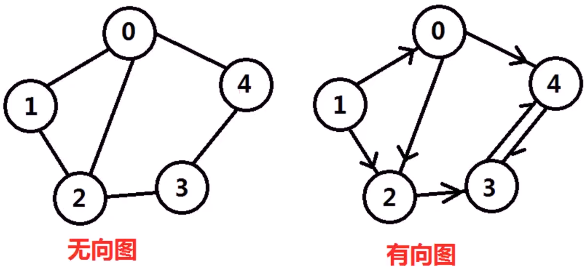

# 图的构造与表示（邻接矩阵）

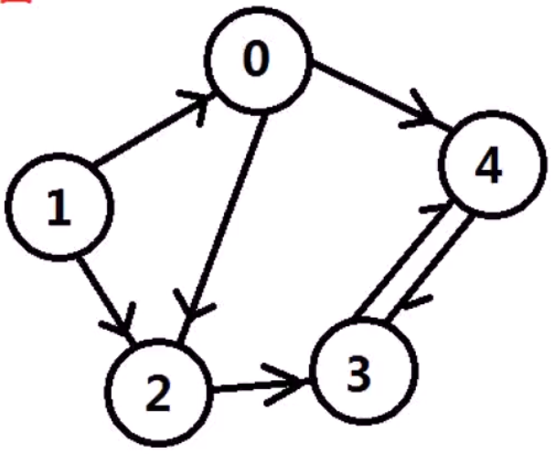

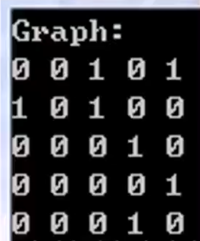

```c++
#include<stdio.h>
int main(){
    const int MAX_N=5;//一共5个顶点
    int Graph[MAX_N][MAX_N]={0};//使用邻接矩阵表示
    Graph[0][2]=1;
    Graph[0][4]=1;
    Graph[1][0]=1;//将图连通，且不带权
    Graph[1][2]=1;//一般用邻接矩阵表示稠密图
    Graph[2][3]=1;
    Graph[3][4]=1;
    Graph[4][3]=1;
    printf("Graph:\n");
    for(int i=0;i<MAX_N;i++){
        for(int j=0;j<MAX_N;j++){
            printf("%d",Graph[i][j]);
        }
        printf("\n");
    }
    return 0;
}
```

# 图的构造与表示（邻接表）

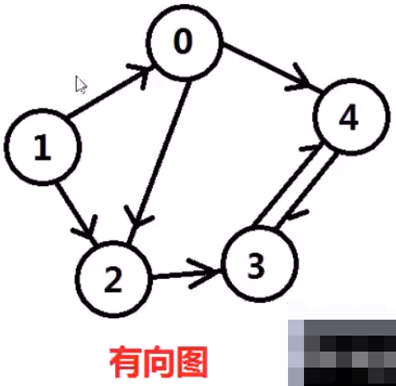

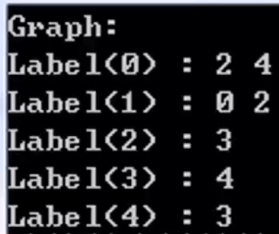

```c++
#include<stdio.h>
#include<vector>
struct GraphNode{//图的邻接表数据结构
    int label;//图的顶点的值//相邻结点指针数组
    std::vector<GraphNode*>neighbors;
    GraphNode(int x):label(x){};
};
int main(){
    const int MAX_N=5;
    GraphNode* Graph[MAX_N];//5个顶点
    for(int i=0;i<MAX_N;i++){
        Graph[i]=new GraphNode(i);
    }//添加边
    Graph[0]->neighbors.push_back(Graph[2]);
    Graph[0]->neighbors.push_back(Graph[4]);
    Graph[1]->neighbors.push_back(Graph[0]);
    Graph[1]->neighbors.push_back(Graph[2]);
    Graph[2]->neighbors.push_back(Graph[3]);
    Graph[3]->neighbors.push_back(Graph[4]);
    Graph[4]->neighbors.push_back(Graph[3]);
    printf("Graph:\n");
    for(int i=0;i<MAX_N;i++){
        printf("Label(%d) : ",i);
        for(int j=0;j<Graph[i]->neighbors.size();j++){
            printf("%d ",Graph[i]->neighbors[j]->label);
        }
        printf("\n");
    }
    for(int i=0;i<MAX_N;i++){
        delete Graph[i];
    }
    return 0;
}
```

# 图的深度优先遍历

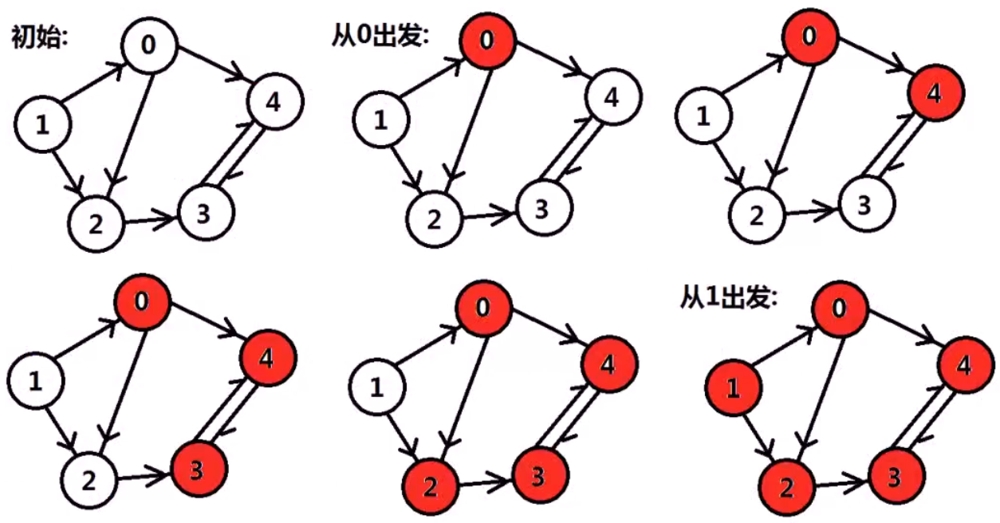

从图中某个顶点v出发，首先访问该顶点，然后依次从它的各个未被访问的邻接点出发深度优先搜索遍历图，直至图中所有和v有路径相同且未被访问的顶点都被访问到。若此时尚有其他顶点未被访问到，则另选一个未被访问的顶点作起始点，重复上述过程，直至图中所有顶点都被访问到为止。

```c++
#include<stdio.h>
#include<vector>
struct GraphNode{//图的邻接表数据结构
    int label;//图的顶点的值//相邻结点指针数组
    std::vector<GraphNode*>neighbors;
    GraphNode(int x):label(x){};
};
void DFS_graph(GraphNode* node, int visit[]){
    visit[node->label]=1;//标记已访问的顶点
    printf("%d ",node->label);//访问相邻的且没有被访问的顶点
    for(int i=0;i<node->neighbors.size();i++){
        if(visit[node->neighbors[i]->label]==0){
            DFS_graph(node->neighbors[i],visit);
        }
    }
}
int main(){
    const int MAX_N=5;//创建图的顶点
    GraphNode* Graph[MAX_N];//5个顶点
    for(int i=0;i<MAX_N;i++){
        Graph[i]=new GraphNode(i);
    }//添加图的边，注意添加边的顺序
    Graph[0]->neighbors.push_back(Graph[4]);
    Graph[0]->neighbors.push_back(Graph[2]);
    Graph[1]->neighbors.push_back(Graph[0]);
    Graph[1]->neighbors.push_back(Graph[2]);
    Graph[2]->neighbors.push_back(Graph[3]);
    Graph[3]->neighbors.push_back(Graph[4]);
    Graph[4]->neighbors.push_back(Graph[3]);
    int visit[MAX_N]={0};//标记已访问的顶点
    for(int i=0;i<MAX_N;i++){
        if(visit[i]==0){//顶点没有被标记才会访问
            printf("From label(%d) : ",Graph[i]->label);
  			DFS_graph(Graph[i],visit);      
        	printf("\n");
        }
    }
    for(int i=0;i<MAX_N;i++){
        delete Graph[i];
    }
    return 0;
}
```

# 图的宽度优先遍历

从图中某个顶点v出发，在访问了v之后依次访问v的各个未曾访问过的邻接点，然后分别从这些邻接点出发依次访问它们的邻接点，并使得“先被访问的顶点的邻接点先于后被访问的顶点的邻接点被访问“，直至图中所有已被访问的顶点的邻接点都被访问到。如果此时图中尚有顶点未被访问，则需要另选一个未曾被访问过的顶点作为新的起始点，重复上述过程，直至图中所有顶点都被访问到为止。

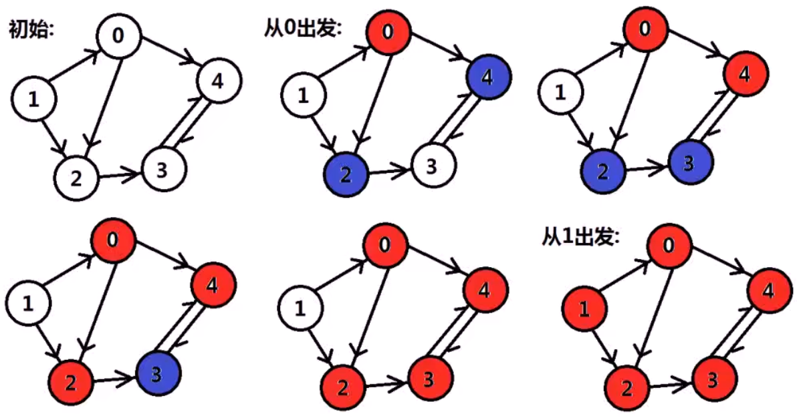

```c++
#include<stdio.h>
#include<vector>
struct GraphNode{//图的邻接表数据结构
    int label;//图的顶点的值//相邻结点指针数组
    std::vector<GraphNode*>neighbors;
    GraphNode(int x):label(x){};
};
void BFS_graph(GraphNode* node, int visit[]){
    std::queue<GraphNode*>Q;
    Q.push(node);
    visit[node->label]=1;//标记已访问的顶点
    while(!Q.empty()){//宽度优先搜索使用队列，队列不空即一直循环
        GraphNode* node=Q.front();
        Q.pop();
        printf("%d ",node->label);
        for(int i=0;i<node->neighbors.size();i++){
            if(visit[node->neighbors[i]->label]==0){
                Q.push(node->neighbors[i]);
                visit[node->neighbors[i]->label]=1;
            }
        }
    }
}
int main(){
    const int MAX_N=5;//创建图的顶点
    GraphNode* Graph[MAX_N];//5个顶点
    for(int i=0;i<MAX_N;i++){
        Graph[i]=new GraphNode(i);
    }//添加图的边，注意添加边的顺序
    Graph[0]->neighbors.push_back(Graph[4]);
    Graph[0]->neighbors.push_back(Graph[2]);
    Graph[1]->neighbors.push_back(Graph[0]);
    Graph[1]->neighbors.push_back(Graph[2]);
    Graph[2]->neighbors.push_back(Graph[3]);
    Graph[3]->neighbors.push_back(Graph[4]);
    Graph[4]->neighbors.push_back(Graph[3]);
    int visit[MAX_N]={0};//标记已访问的顶点
    for(int i=0;i<MAX_N;i++){
        if(visit[i]==0){//顶点没有被标记才会访问
            printf("From label(%d) : ",Graph[i]->label);
  			BFS_graph(Graph[i],visit);
        	printf("\n");
        }
    }
    for(int i=0;i<MAX_N;i++){
        delete Graph[i];
    }
    return 0;
}
```

