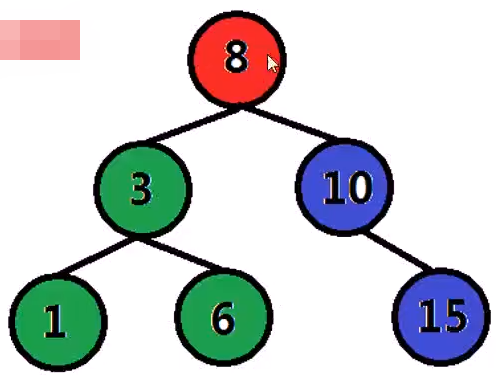
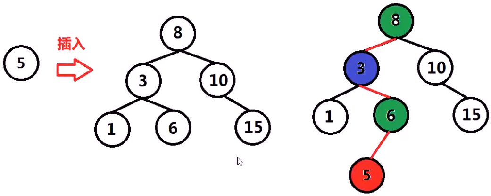
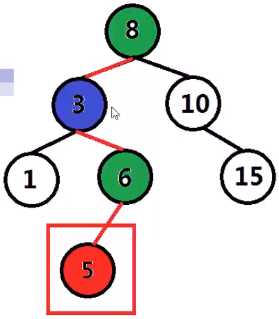
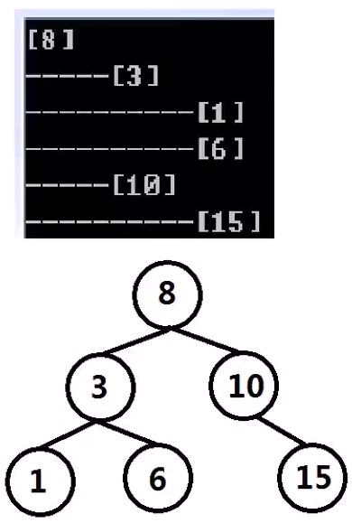
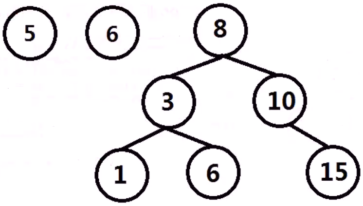

# 二分查找与二叉查找树

|                            |        |                                                              |
| -------------------------- | ------ | ------------------------------------------------------------ |
| 插入位置（二分查找）       | easy   | https://leetcode.cn/problems/search-insert-position/description/ |
| 区间查找（二分查找）       | medium | https://leetcode.cn/problems/search-for-a-range/description/ |
| 旋转数组查找（二分查找）   | medium | https://leetcode.cn/problems/search-in-rotated-sorted-array/description/ |
| 二叉查找树编码与解码       | medium | https://leetcode.cn/problems/serialize-and-deserialize-bst/description/ |
| 逆序数（二叉查找树的应用） | hard   | https://leetcode.cn/problems/count-of-smaller-numbers-after-self/description/ |

# 二分查找

已知一个排序数组A，如A=[-1,2,5,20,90,100,207,800]，

另外一个乱序数组B，如B=[50,90,3,-1,207,80]，

求B中的任意某个元素，是否在A中出现，结果存储在数组C中，出现用1代表，未出现用0代表，如，C=[0,1,0,1,1,0]。

```c++
//返回结果数组，排序数组，乱序数组
std::vector<int>search_array(std::vector<int>&sort_array,std::vector<int>&random_array){
    
}
```

# 二分查找算法

二分查找又称折半查找，首先，假设表中元素是按升序排列，将表中间位置的关键字与查找关键字比较：

1. 如果两者相等，则查找成功；
2. 否则利用中间位置将表分成前、后两个子表：
   1. 如果中间位置的关键字大于查找关键字，则进一步查找前一子表
   2. 否则进一步查找后一子表

重复以上过程，直到找到满足条件的记录，使查找成功，或直到子表不存在为止，此时查找不成功。

例如，待搜索数字target==2,200

数组A=[-1,2,5,20,90,100,207,800]

# 二分查找（递归）

```c++
#include<vector>
//搜索到返回true 否则返回false，排序数组，待搜索的区间左端、右端，搜索目标
bool binary_search(std::vector<int>&sort_array,int begin, int end, int target){
    if(begin>end){
        return false;
    }
    int mid=(begin+end)/2;
    if(target==sort_array[mid]){//当找到时
        return true;
    }
    else if(target<sort_array[mid]){
        return binary_search(sort_array, begin, mid-1, target);
    }
    else if(target>sort_array[mid]){
        return binary_search(sort_array, mid+1, end, target);
    }
}
```

# 二分查找（循环）

```c++
//排序数组，搜索目标
bool binary_search(std::vector<int>&sort_array, int target){
    int begin=0;
    int end=sort_array.size()-1;
    while(begin<=end){
        int mid=(begin+end)/2;
        if(target==sort_array[mid]){
            return true;
        }
        else if(target<sort_array[mid]){
            end = mid-1;
        }
        else if(target>sort_array[mid]){
            begin = mid+1;
        }
    }
    return false;
}
```

# 二叉查找（排序）树



二叉查找树（Binary Search Tree），它是一棵具有下列性质的二叉树：

1. 若左子树不空，则左子树上所有结点的值均小于或等于它的根结点的值；
2. 若右子树不空，则右子树上所有结点的值均大于或等于它的根结点的值；
3. 左、右子树也分别为二叉排序树。
4. 等于的情况只能出现在左子树或右子树中的某一侧。

```c++
struct TreeNode{//与二叉树的数据结构完全相同
    int val;
    TreeNode* left;
    TreeNode* right;
    TreeNode(int x):
    	val(x),left(NULL),right(NULL){}
}
```

由于二叉查找树的中序遍历是从小到大的，故又名二叉排序树（Binary Sort Tree）。

# 二叉查找树插入结点



将某结点（insert_node），插入至以node为根二叉查找树中：

如果insert_node结点值小于当前node结点值：

如果node有左子树，则递归的将该结点插入至左子树为根二叉排序树中

否则，将node->left赋值为该结点地址

否则（大于等于情况）：

如果node有右子树，则递归的将该结点插入至右子树为根二叉排序树中

否则，将node->right赋值为该结点地址



```c++
void BST_insert(TreeNode* node, TreeNode* insert_node){
    if(insert_node->val<node->val){
        if(node->left){//当左子树不空的时候，递归地将insert_node插入左子树
            BST_insert(node->left, insert_node);
        }
        else{//当左子树为空时，将node的左指针与待插入结点相连接
            node->left=insert_node;
        }
    }
    else{
        if(node->right){//当右子树不空的时候，递归的将insert_node插入右子树
            BST_insert(node->right, insert_node);
        }
        else{//当右子树为空时，将node的右指针与待插入结点相连接
            node->right=insert_node;
        }
    }
}
```



```c++
//二叉树前序遍历
void preorder_print(TreeNode* node, int layer){
    if(!node){
        return;
    }
    for(int i=0;i<layer;i++){
        printf("-----");
    }
    printf("[%d]\n",node->val);
    preorder_print(node->left,layer+1);
    preorder_print(node->right,layer+1);
}
//将test中的结点，按顺序插入到root中
int main(){
    TreeNode root(8);//以8为根的二叉树
    std::vector<TreeNode*>node_vec;
    int test[]={3,10,1,6,15};
    for(int i=0;i<5;i++){
        node_vec.push_back(new TreeNode(test[i]));
    }
    for(int i=0;i<node_vec.size();i++){
        BST_insert(&root, node_vec[i]);
    }
    preorder_print(&root, 0);
    return 0;
}
```

# 二叉查找树查找数值



查找数值value是否在二叉查找树中出现：

如果value等于当前查看node的结点值：返回真

如果value结点值小于当前node结点值：

​	如果当前结点有左子树，继续在左子树中查找该值；否则，返回假

否则（value结点值大于当前node结点值）：

​	如果当前结点有右子树，继续在右子树中查找该值；否则，返回假

```c++
bool BST_search(TreeNode* node, int value){
    if(node->val==value){//当前结点值就是value,找到了返回真
        return true;
    }
    if(node->val>value){//value小于当前node结点值
        if(node->left){//node结点有左子树，继续搜索node结点左子树
            return BST_search(node->left, value);
        }
        else{
            return false;
        }
    }
    else{
        if(node->right){//右子树不空时，继续搜索node结点右子树
            return BST_search(node->right, value);
        }
        else{
            return false;
        }
    }
}
```

