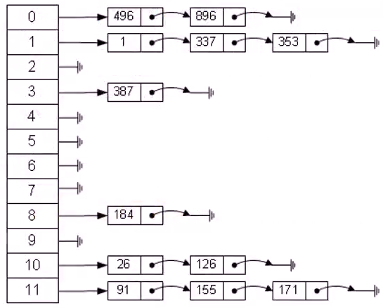
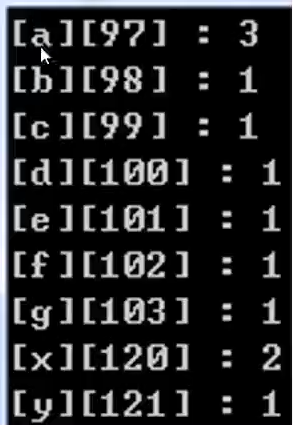
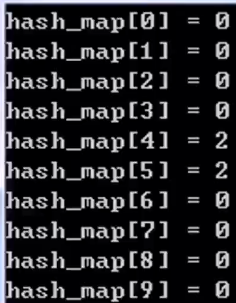
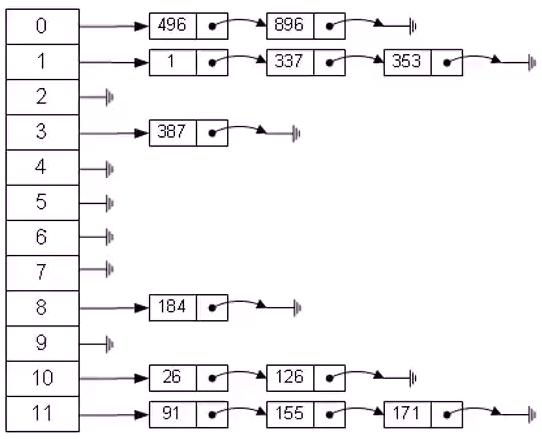

# 哈希表与字符串

|                                  |        |                                                              |
| -------------------------------- | ------ | ------------------------------------------------------------ |
| 最长回文串（字符哈希）           | easy   | https://leetcode.cn/problems/longest-palindrome/description/ |
| 词语模式（字符串哈希）           | easy   | https://leetcode.cn/problems/word-pattern/description/       |
| 同字符词语分组（数组哈希）       | medium | https://leetcode.cn/problems/group-anagrams/description/     |
| 无重复字符的最长子串（字符哈希） | medium | https://leetcode.cn/problems/longest-substring-without-repeating-characters/description/ |
| 重复的DNA序列（字串符哈希）      | medium | https://leetcode.cn/problems/repeated-dna-sequences/description/ |
| 最小窗口子串（哈希维护窗口）     | hard   | https://leetcode.cn/problems/minimum-window-substring/description/ |

# 哈希表定义

哈希表（Hash table, 也叫散列表），是根据关键字值（key）直接进行访问的数据结构，它通过把关键字值映射到表中一个位置（数组下标）来直接访问，以加快查找关键字值的速度。这个映射函数叫做哈希（散列）函数，存放记录的数组叫做哈希（散列）表。

给定表M，存在函数f(key)，对任意的关键字key，代入函数后若能得到包含该关键字的表中地址，称表M为哈希（Hash）表，函数f(key)为哈希（Hash）函数。



# 字符哈希



```c++
#include<stdio.h>
#include<string>//ASC2码 从0-127，故使用数组下标做映射，最大范围至128
int main(){
    int char_map[128]={0};
    std::string str="abcdefgaaxxy";
    //统计字符串中，各个字符的数量
    //char_map['a']++;即char_map[97]++
    //char_map['b']++;即char_map[98]++
    for(int i=0;i<str.length();i++){
        char_map[str[i]]++;
    }
    for(int i=0;i<128;i++){
        if(char_map[i]>0){
            printf("[%c][%d] : %d\n",i,i,char_map[i]);
        }
    }
    return 0;
}
```

# 哈希表排序整数

```c++
#include<stdio.h>//哈希表排序，使用数组的下标对正整数排序
//哈希表表的长度，需要超过最大待排序数字
int main(){
    int random[10]={999,1,444,7,20,9,1,3,7,7};
    int hash_map[1000]={0};
    for(int i=0;i<10;i++){
        hash_map[random[i]]++;
    }
    for(int i=0;i<1000;i++){
        for(int j=0;j<hash_map[i];j++){
            printf("%d\n",i);
        }
    }//事件复杂度O(表长+n)n为元素个数
    return 0;
}
```

# 任意元素的映射

1. 当遇到负数或非常大的整数，如何进行哈希（映射）？

   如：-5、000000000、...

2. 当遇到字符串，如何进行哈希（映射）？

   如：abcdefg、XYZ、...

3. 当遇其他到无法直接映射的数据类型，如浮点数、数组、对象等等，如何进行哈希（映射）？

   如：1.2345、[1,2,3]、...

解决：利用哈希函数，将关键字值（key)（大整数、字符串、浮点数等）转换为整数再对表长取余，从而关键字值被转换为哈希表的表长范围内的整数。

# 发生冲突



```c++
#include<stdio.h>
#include<string>
//直接对整数取余表长再返回
int int_func(int key, int table_len){
    return key%table_len;
}
//将字符串中的字符的ASC2码相加得到整数再取余表长
int string_func(std::string key, int table_len){
    int sum=0;
    for(int i=0;i<key.length();i++){
        sum+=key[i];
    }
    return sum%table_len;//不同的整数或字符串，由于哈希函数的选择，被映射到了同一个下标处！产生了冲突！
}
int main(){
    const int TABLE_LEN=10;
    int hash_map[TABLE_LEN]={0};
    hash_map[int_func(99999995,TABLE_LEN)]++;
    hash_map[int_func(5,TABLE_LEN)]++;
    hash_map[string_func("abc",TABLE_LEN)]++;
    hash_map[string_func("bac",TABLE_LEN)]++;
    for(int i=0;i<TABLE_LEN;i++){
        printf("hash_map[%d]=%d\n",i,hash_map[i]);
    }
    return 0;
}
```

# 拉链法解决冲突，构造哈希表



将所有哈希函数结果相同的结点连接在同一个单链表中。

若选定的哈希表长度为m，则可将哈希表定义为一个长度为m的指针数组t[0...m-1]，指针数组中的每个指针指向哈希函数结果相同的单链表。

插入value:

将元素value插入哈希表，若元素value的哈希函数值为hash_key，将value对应的结点以头插法的方式插入到以t[hash_key]为头指针的单链表中。

查找value:

若元素value的哈希函数值为hash_key，遍历以t[hash_key]为头指针的单链表，查找链表各个结点的值域是否为value。

```c++
struct ListNode{//哈希表即为普通的单链表构成
    int val;
    ListNode* next;
    ListNode(int x):val(x),next(NULL){}
};
int hash_func(int key, int table_len){
    return key&table_len;//整数哈希函数，直接取余
}
void insert(ListNode* hash_table[], ListNode* node, int table_len){
    int hash_key = hash_func(node->val, table_len);
    node->next=hash_table[hash_key]->next; //使用头插法插入结点
	hash_table[hash_key]=node;
}
bool search(ListNode* hash_table[], int value, int table_len){
    int hash_key=hash_func(value,table_len);
    ListNode* head = hash_table[hash_key];
    while(head){
        if(head->val==value){
            return ture;
        }
        head=head->next;
    }
    return false;
}
```

# 哈希map与STL map

```c++
#include<stdio.h>
#include<map>
#include<string>
struct ListNode{//将字符串key映射为整数val
    std::string key;
    int val;
    ListNode* next;
    ListNode(int x):val(x),next(NULL){}
};
int main(){//将字符串key映射为整数val
    std::map<std::string, int>hash_map;
    std::string str1="abc";
    std::string str2="aaa";
    std::string str3="xxxxx";
    hash_map[str1]=1;
    hash_map[str2]=2;
    hash_map[str3]=100;
    if(hash_map.find(str1)!=hash_map.end()){
        printf("%s is in hash_map, value is %d\n",
              str1.c_str(),hash_map[str1]);
    }
    std::map<std::string, int>::iterator it;
    for(it=hash_map.begin();it!=hash_map.end();it++){
        printf("hash_map[%s]=%d\n",it->first.c_str(),it->second);
    }
    return 0;
}
```

