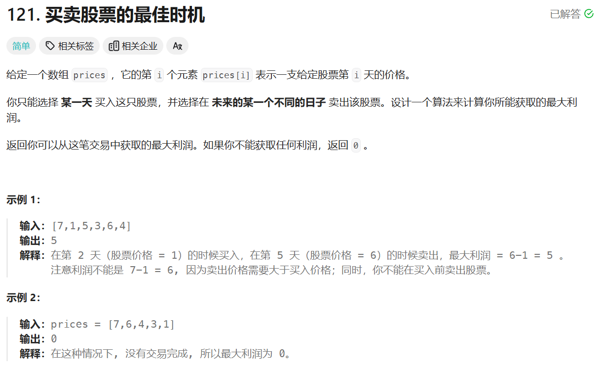
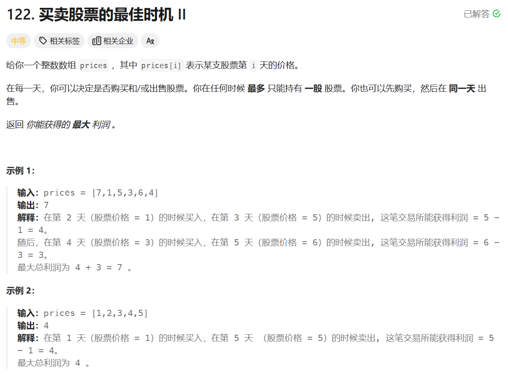
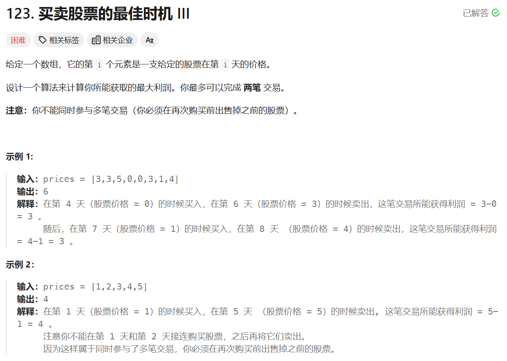

# 乐水私募

# 二分查找

## 1

[668. 乘法表中第k小的数 - 力扣（LeetCode）](https://leetcode.cn/problems/kth-smallest-number-in-multiplication-table/description/)


```c++
class Solution {
public:
    int findKthNumber(int m, int n, int k) {
        int left = 1, right =m*n;
        while(left<=right){
            int count= 0;
            int mid = (left+right)/2;
            for(int i=1;i<=m;i++){//遍历每一行
                count+=std::min(mid/i,n);//根据第一列计算每一行大于mid的数目
            }
            if(count>=k){//符合条件的mid尽可能小，巧妙处理了那些不在乘法表中的数（质数）
                right = mid-1;
            } 
            else{
                left = mid+1;
            }
        }
        return left;
    }
};
```

# 搜索、贪心

## 2

[85. 最大矩形 - 力扣（LeetCode）](https://leetcode.cn/problems/maximal-rectangle/description/)


```c++
class Solution {
public:
    int maximalRectangle(vector<vector<char>>& matrix) {
        int m = matrix.size();
        if (m == 0) {
            return 0;
        }
        int n = matrix[0].size();
        vector<vector<int>> left(m, vector<int>(n, 0));
		//计算出矩阵的每个元素的左边连续1的数量，使用二维数组left记录
        for (int i = 0; i < m; i++) {
            for (int j = 0; j < n; j++) {
                if (matrix[i][j] == '1') {
                    left[i][j] = (j == 0 ? 0: left[i][j - 1]) + 1;
                }
            }
        }
        int ret = 0;
        for (int i = 0; i < m; i++) {//遍历每个点，计算出当前点最大矩形面积
            for (int j = 0; j < n; j++) {
                if (matrix[i][j] == '0') {
                    continue;
                }
                int width = left[i][j];
                int area = width;
                for (int k = i - 1; k >= 0; k--) {
                    width = min(width, left[k][j]);//向上柱状遍历
                    area = max(area, (i - k + 1) * width);//保留最大面积，height=(i-k+1)
                }
                ret = max(ret, area);
            }
        }
        return ret;
    }
};
```

## 3

[407. 接雨水 II - 力扣（LeetCode）](https://leetcode.cn/problems/trapping-rain-water-ii/description/)


```c++
class Solution {
public:
    int trapRainWater(std::vector<std::vector<int>>& heightMap) {
        int m = heightMap.size();
        if (m == 0) return 0;
        int n = heightMap[0].size();
        if (n == 0) return 0;

        std::vector<std::vector<bool>> visited(m, std::vector<bool>(n, false));//是否被搜索过
        std::priority_queue<std::pair<int, std::pair<int, int>>, std::vector<std::pair<int, std::pair<int, int>>>, std::greater<std::pair<int, std::pair<int, int>>>> pq;//最小堆

        // 将边界加入优先队列
        for (int i = 0; i < m; i++) {//左右边界
            pq.push({heightMap[i][0], {i, 0}});//pq.push({int,pair})
            visited[i][0] = true;
            pq.push({heightMap[i][n - 1], {i, n - 1}});
            visited[i][n - 1] = true;
        }
        for (int j = 1; j < n - 1; j++) {//上下边界
            pq.push({heightMap[0][j], {0, j}});
            visited[0][j] = true;
            pq.push({heightMap[m - 1][j], {m - 1, j}});
            visited[m - 1][j] = true;
        }

        int ans = 0;
        int dirs[4][2] = {{0, 1}, {0, -1}, {1, 0}, {-1, 0}};//方向矩阵
        while (!pq.empty()) {
            auto top = pq.top();
            pq.pop();
            for (auto dir : dirs) {
                int newX = top.second.first + dir[0];
                int newY = top.second.second + dir[1];
                if (newX >= 0 && newX < m && newY >= 0 && newY < n &&!visited[newX][newY]) {
                    visited[newX][newY] = true;
                    ans += std::max(0, top.first - heightMap[newX][newY]);//当前点的高度高于拓展点时
                    pq.push({std::max(top.first, heightMap[newX][newY]), {newX, newY}});//积水后水平面升高
                }
            }
        }
        return ans;
    }
};
```

# 贪心、动态规划

## 4

[121. 买卖股票的最佳时机 - 力扣（LeetCode）](https://leetcode.cn/problems/best-time-to-buy-and-sell-stock/description/)



```c++
//时间复杂度: O(n), 只需遍历一次
//空间复杂度: O(1), 只使用了两个变量
class Solution {
public:
    int maxProfit(vector<int>& prices) {
        int inf = 1e9;
        //minprice股票最低价格；maxprofit当前所能获得最大利润
        int minprice = inf, maxprofit = 0;
        for (int price: prices) {//循环迭代输入的prices
            maxprofit = max(maxprofit, price - minprice);//当前获得的利润大于maxprofit时修改maxprofit
            minprice = min(price, minprice);//当前价格小于minprice时修改minprice
        }
        return maxprofit;
    }
};
```

[122. 买卖股票的最佳时机 II - 力扣（LeetCode）](https://leetcode.cn/problems/best-time-to-buy-and-sell-stock-ii/description/)



```c++
class Solution {
public:
    int maxProfit(vector<int>& prices) {
        int n = prices.size();
        int dp[n][2];
        //第0天交易结束时(第0天现实里就是第1天)
        dp[0][0] = 0, dp[0][1] = -prices[0];
        //dp[i][0]表示第i天交易完后手里没有股票的最大利润
        //dp[i][1]表示第i天交易完后手里持有一支股票的最大利润(i从0开始)
        for (int i = 1; i < n; ++i) {
            //第i天不持有=max(第i-1天不持有,第i-1天持有今天卖出)
            dp[i][0] = max(dp[i - 1][0], dp[i - 1][1] + prices[i]);
            //第i天持有=max(第i-1天持有,第i-1天不持有今天买入)
            dp[i][1] = max(dp[i - 1][1], dp[i - 1][0] - prices[i]);
        }
        //全部交易结束后,持有股票的收益一定低于不持有股票的收益,
        //因此这时候dp[n-1][0]的收益必然是大于dp[n-1][1]的,所以返回dp[n-1][0]
        return dp[n - 1][0];
    }
};
```

[123. 买卖股票的最佳时机 III - 力扣（LeetCode）](https://leetcode.cn/problems/best-time-to-buy-and-sell-stock-iii/description/)



```c++
class Solution {
public:
    int maxProfit(vector<int>& prices) {
        int n = prices.size();
        int dp[n][3][2];
        dp[0][0][0] = 0;//第0天第0次交易不持有
        dp[0][0][1] = -prices[0];//第0天第0次交易持有
        dp[0][1][0] = 0;//第0天第1次交易不持有
        dp[0][1][1] = -prices[0];//第0天第1次交易持有
        dp[0][2][0] = 0;//第0天第2次交易不持有
        dp[0][2][1] = -prices[0];//第0天第2次交易持有
        for(int i = 1; i < n; i++) {
            //第i天第0次交易持有=max(第i-1天第0次交易持有,第i-1天第0次交易不持有第i天买入)
            dp[i][0][1] = max(dp[i - 1][0][1], -prices[i]);
            for(int j = 1; j < 3; j++) {
                //第i天第j次交易不持有=max(第i-1天第j次交易不持有,第i天第j-1次交易持有第i天卖出)
                dp[i][j][0] = max(dp[i - 1][j][0], dp[i][j - 1][1] + prices[i]);
                //第i天第j次交易持有=max(第i-1天第j次交易持有,第i天第j次交易不持有第i天买入)
                dp[i][j][1] = max(dp[i - 1][j][1], dp[i][j][0] - prices[i]);
            }
        }
        return dp[n-1][2][0];
    }
};
```

[188. 买卖股票的最佳时机 IV - 力扣（LeetCode）](https://leetcode.cn/problems/best-time-to-buy-and-sell-stock-iv/description/)


```c++
//时间复杂度:O(nk),其中n为prices的长度
//空间复杂度:O(nk)
class Solution {
public:
    int maxProfit(int k, vector<int>& prices) {
        int n = prices.size();
        vector<vector<array<int, 2>>> dp(n + 1, vector<array<int, 2>>(k + 2, {INT_MIN / 2, INT_MIN / 2}));
        for (int j = 1; j <= k + 1; j++) {
            dp[0][j][0] = 0;//第0天第j笔交易不持有->0收益
        }
        for (int i = 0; i < n; i++) {
            for (int j = 1; j <= k + 1; j++) {
                //今天第j笔交易不持有收益 = max(昨天第j笔交易不持有股票收益,昨天第j笔交易持有卖出收益)
                dp[i + 1][j][0] = max(dp[i][j][0], dp[i][j][1] + prices[i]);
                //今天第j笔交易不持有收益 = max(昨天第j笔交易持有股票收益,昨天第j-1笔交易不持有买入收益)
                dp[i + 1][j][1] = max(dp[i][j][1], dp[i][j - 1][0] - prices[i]);
            }
        }
        return dp[n][k + 1][0];
    }
};
```

# 其他

## 5

两列火车同时被运输机空投到一条南北向铁路上的不同位置（降落后自动卸下降落伞），火车上分别装载了一颗炸弹，但是只有两列火车相撞才能引爆炸弹，用以下指令为两列火车编写同一套自动驾驶程序，让它们完成相撞炸毁铁路（假设火车移动速度1m/s，执行c、d指令不需耗时）（只能用以下4行指令，不能使用if...else，while，for循环等等其他高级语言）（GOTO是指令跳转到某一行代码继续执行）

a) GO NORTH 1m

b) GO SOUTH 1m

c) GOTO line xxx

d) if find a 降落伞，GOTO line xxx

思想：快慢指针

| line index | instruction                   |
| ---------- | ----------------------------- |
| 1          | GO SOUTH 1m                   |
| 2          | GO NORTH 1m                   |
| 3          | GO NORTH 1m                   |
| 4          | if find a 降落伞，GOTO line 6 |
| 5          | GOTO line 1                   |
| 6          | GO NORTH 1m                   |
| 7          | GOTO line 6                   |

## 6

$$
\begin{align}
&给定两个等长的\text{double}数组，X_n，Y_n，对任意i=1,2,3,...,n，满足x,y在[-1,1]范围内，我们已知相关系数公式，给定服务器的计算资源，\\&主频\text{3G}的\text{cpu}，256核，内存1\text{T}。请编写一个高性能的函数，计算相关系数，要求尽可能高并发的打满全部计算资源，写明优化思路，编写计算\\
&函数\text{double corr}(X_n, Y_n)。n等于10的9次方\\
&注意:没有并发，没有性能优化的代码不得分，手动写计算思路和伪代码可以得分。
\end{align}
$$

优化思路：

1. 利用多线程充分发挥多核CPU的优势，将数据分成多个块，每个线程处理一个块，从而实现并行计算。
2. 合理分配内存，避免内存不足的情况。由于数据量较大，可以考虑使用内存映射文件等技术来减少内存压力。
3. 对于相关系数的计算，可以将计算过程分解为多个子任务，每个子任务计算一部分数据的中间结果，最后再合并这些中间结果得到最终的相关系数。

伪代码：

```
function corr(Xn,Yn)
	//确定线程数量和数据块大小
	n=length(Xn)
	numThreads=256
	chunkSize=n/numThreads
	//初始化用于存储部分结果的变量
	sumX=0
	sumY=0
	sumSqX=0
	sumSqY=0
	productSumXY=0
	//创建线程列表
	threads=[]
	//启动多个线程进行并行计算
	for i=0 to numThreads-1
		start = i*chunkSize
		end = if i==numThreads-1 then n else start+chunkSize
		create a new thread with function:
			//取数据块
			subX=slice(Xn,start,end)
			subY=slice(Yn,start,end)
			//计算部分和、平方和、乘积和
			localSumX=sum(subX)
			localSumY=sum(subY)
			localSumSqX=sumOfSquares(subX)
			localSumSqY=sumOfSquares(subY)
			localProductSumXY=productSum(subX,subY)
			//将部分结果累加到全局变量
			add localSumX to sumX
			add localSumY to sumY
			add localSumSqX to sumSqX
			add localSumSqY to sumSqY
			add localProductSumXY to productSumXY
        add the thread to threads list
    
    //等待所有线程完成
    for each thread in threads
    	if thread is joinable
    		join thread
    
    //计算平均值和相关系数分子分母
    meanX=sumX/n
    meanY=sumY/n
    numerator=productSumXY-n*meanX*meanY
    denominatorPart1=sumSqX-n*meanX*meanX
    denominatorPart2=sumSqY-n*meanY*meanY
    if denominatorPart1*denominatorPart2==0
    	return 0
    else
    	return numerator/sqrt(denominatorPart1*denominatorPart2)

//求和函数
function sum(arr)
	//遍历数组求和
	s=0
	for each value in arr
		s=s+value
    return s

//求平方和函数
function sumOfSquares(arr)
	//遍历数组求平方和
	s=0
	for each value in arr
		s=s+value*value
    return s
    
//求乘积和函数
function productSum(arr1,arr2)
	//遍历两个等长数组求对应元素乘积和
	s=0
	for i=0 to length(arr1)-1
		s=s+arr1[i]*arr2[i]
	return s
```

内存映射文件技术是一种将文件或设备映射到进程地址空间的技术，允许应用程序像访问内存一样访问文件。通过这种方式，操作系统将文件内容映射到内存中，使得应用程序可以直接读写内存，而不需要通过常规的文件输入/输出（I/O）操作来处理。

主要特点和优点：
高效性：内存映射文件可以减少文件操作的开销，因为它允许直接在内存中操作文件内容，从而提高了访问速度。

共享内存：多个进程可以映射同一个文件，这使得它们可以轻松共享数据。

自动管理：操作系统会在需要时自动加载文件内容到内存中，用户不需要手动管理缓冲区。

简化编程：开发者可以通过指针直接操作文件内容，避免了复杂的读写操作。

应用场景：
大型文件的处理，如数据库、图像处理等。
需要共享内存的多进程应用。
实现文件的随机访问。
实现方式：
在不同的操作系统中，内存映射文件的实现细节可能有所不同。例如，在Windows中，可以使用CreateFileMapping和MapViewOfFile等API，而在Unix/Linux中，通常使用mmap系统调用。

总的来说，内存映射文件技术是一种高效的文件处理方式，广泛应用于需要高性能和大规模数据处理的场景。


