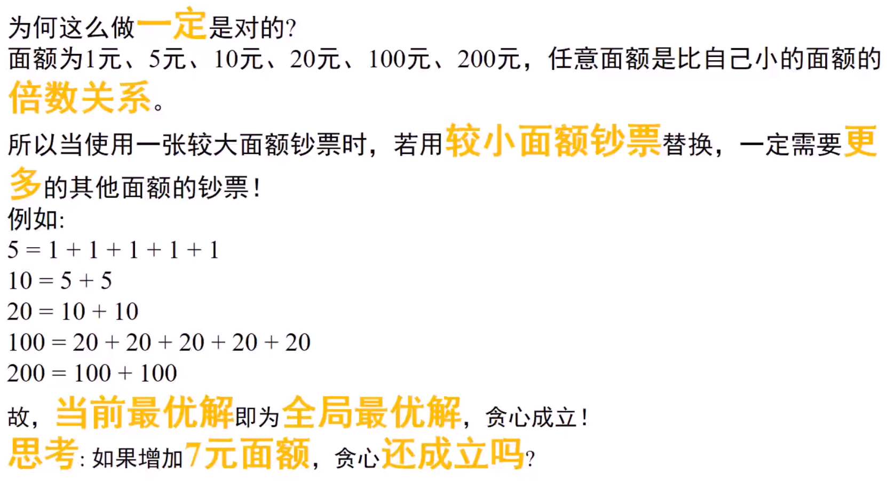
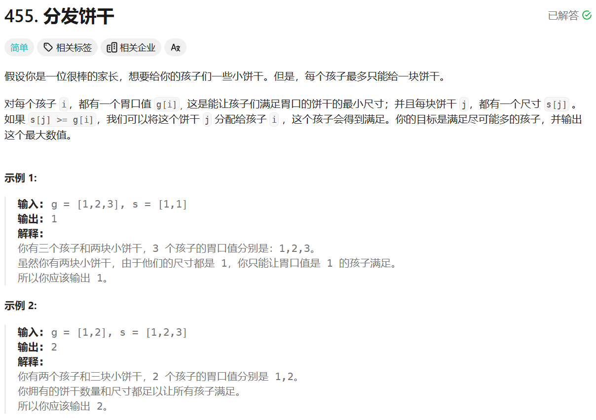
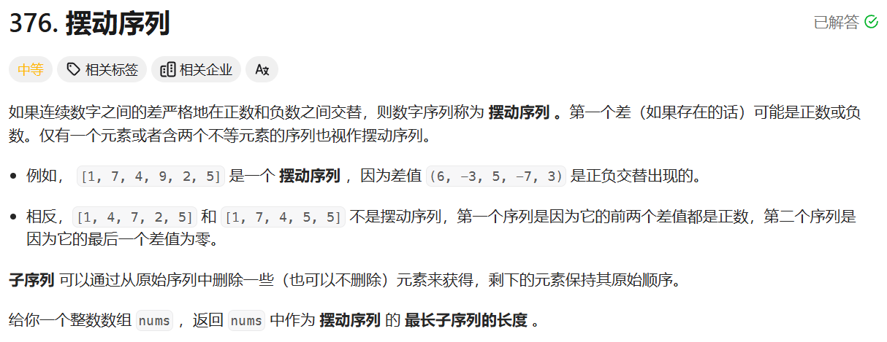
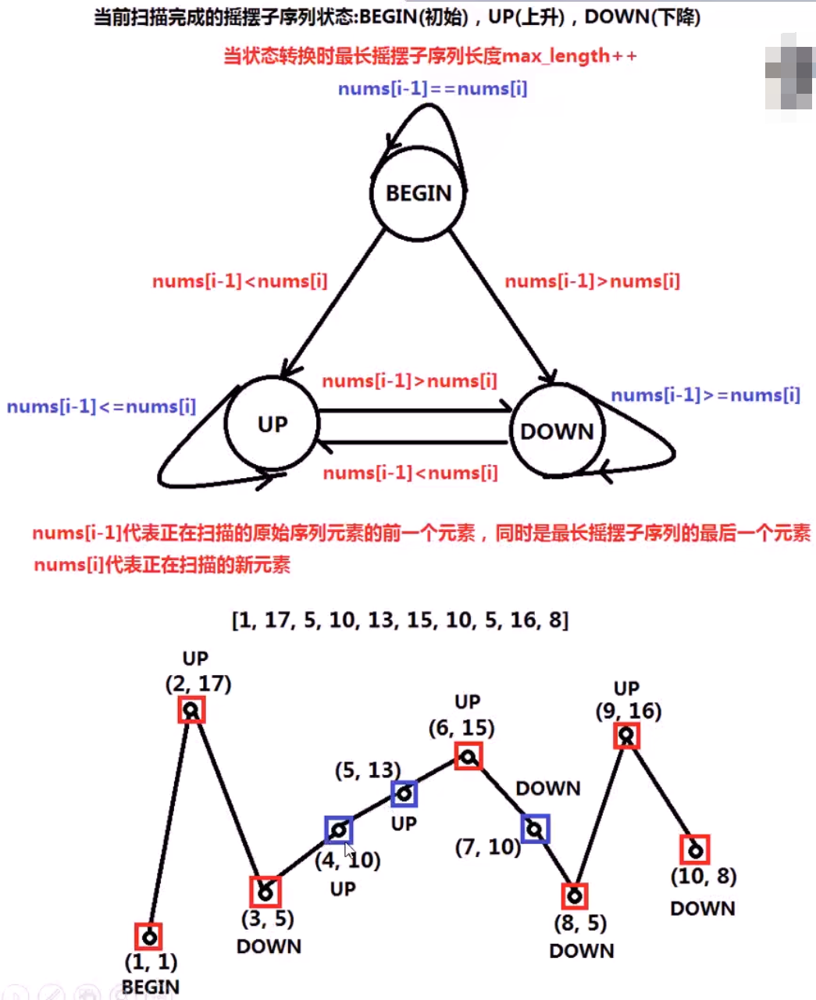

# 贪心算法

|                          |        |                                                              |
| ------------------------ | ------ | ------------------------------------------------------------ |
| 分糖果（排序、贪心）     | easy   | https://leetcode.cn/problems/assign-cookies/description/     |
| 摇摆序列（贪心）         | medium | https://leetcode.cn/problems/wiggle-subsequence/description/ |
| 移除K个数字（栈、贪心）  | medium | https://leetcode.cn/problems/remove-k-digits/description/    |
| 跳跃游戏（贪心）         | medium | https://leetcode.cn/problems/jump-game/description/          |
| 跳跃游戏2（贪心）        | hard   | https://leetcode.cn/problems/jump-game-ii/description/       |
| 射击气球（排序、贪心）   | medium | https://leetcode.cn/problems/minimum-number-of-arrows-to-burst-balloons/description/ |
| 最优加油方法（堆、贪心） | hard   | http://poj.org/problem?id=2431                               |

# 钞票支付问题




```c++
#include<stdio.h>
int main(){
    const int RMB[] = {200,100,20,10,5,1};
    const int NUM=6;//6种面值
    int X=628;
    int count=0;
    for(int i=0;i<NUM;i++){
        int use=X/RMB[i];//需要面额为RMB[i]的use张
        count+=use;//总计增加use张
        X=X-RMB[i]*use;//将总额减去使用RMB[i]已组成的金额
        printf("需要面额为%d的%d张, ",RMB[i],use);
        printf("剩余需要支付金额%d.\n",X);
    }
    printf("总共需要%d张\n",count);
    return 0;
}
```

# 分糖果（排序、贪心）



```c++
class Solution {
public:
    int findContentChildren(vector<int>& g, vector<int>& s) {
        std::sort(g.begin(),g.end());
        std::sort(s.begin(),s.end());//对孩子的需求因子g与糖果大小s两数组排序
        int child=0;//child代表已满足了几个孩子，cookie代表尝试了几个糖果
        int cookie=0;
        while(child<g.size()&&cookie<s.size()){//当孩子或糖果同时均未尝试完时
            if(g[child]<=s[cookie]){//当孩子的满足因子小于或等于糖果大小时
                child++;//该糖果满足了孩子，孩子指针child向后移动
            }
            cookie++;//无论成功或失败，每个糖果只尝试一次，cookie向后移动
        }
        return child;//最终child即为得到满足的孩子的个数
    }
};
```

# 摇摆序列（贪心）





```c++
class Solution {
public:
    int wiggleMaxLength(vector<int>& nums) {
        if(nums.size()<2){
            return nums.size();//序列个数小于2时直接为摇摆序列
        }
        static const int BEGIN=0;
        static const int UP=1;//扫描序列时的三种状态
        static const int DOWN=2;
        int STATE = BEGIN;
        int max_length=1;//摇摆序列最大长度至少为1
        //从第二个元素元素开始扫描
        for(int i=1;i<nums.size();i++){
            switch(STATE){
                case BEGIN:
                    if(nums[i-1]<nums[i]){
                        STATE=UP;
                        max_length++;
                    }
                    else if(nums[i-1]>nums[i]){
                        STATE=DOWN;
                        max_length++;
                    }
                    break;
                case UP:
                    if(nums[i-1]>nums[i]){
                        STATE=DOWN;
                        max_length++;
                    }
                    break;
                case DOWN:
                    if(nums[i-1]<nums[i]){
                        STATE=UP;
                        max_length++;
                    }
                    break;
            }
        }
        return max_length;
    }
};
```

# 移除K个数字（栈、贪心）57:43


# 跳跃游戏（贪心）


# 跳跃游戏2（贪心）


# 射击气球（排序、贪心）


# 最优加油方法（堆、贪心）
